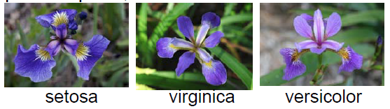
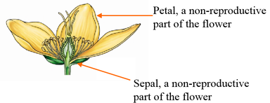

```{r setup, include=FALSE}
knitr::opts_chunk$set(echo = TRUE)
```
```{r set-options, echo=FALSE, cache=FALSE}
options(width = 200)
```

# Supervised Learning: Classification Analysis 

The outcome $Y$ is available (also called dependent variable, response in statistics). Then, a set of predictors, regressors, covariates, features, or independent variables. 

There are two main types of problems, *regression problem* and *classification problem*. 

## K-Nearest Neighbor (KNN)

In order to demonstrate this simple machine learning algorithm, I use Iris dataset, a famous dataset for almost all machine learning courses, and apply KNN onto the dataset to train a classifier for Iris Species.

### Load and prepare the Iris dataset

Before start, always do 

* set the working directory!
* create a new R script (unless you are continuing last project)
* Save the R script.

Let's first load the **Iris** dataset. This is a very famous dataset in almost all data mining, machine learning courses, and it has been an R build-in dataset. The dataset consists of 50 samples from each of three species of Iris flowers (Iris setosa, Iris virginicaand Iris versicolor). Four features(variables) were measured from each sample, they are the **length** and the **width** of sepal and petal, in centimeters. It is introduced by Sir Ronald Fisher in 1936.

- 3 Species



- Four features of flower: **length** and the **width** of sepal and petal




The *iris* flower data set is included in R. It is a data frame with 150 cases (rows) and 5 variables (columns) named Sepal.Length, Sepal.Width, Petal.Length, Petal.Width, and Species.

First, load iris data to the current workspace
 
```{r}
data(iris)
iris
```

What is in the dataset? You can use `head()` or `tail()` to print the first or last few rows of a dataset:
```{r}
head(iris)
```

Check dimensionality, the dataset has 150 rows(observations) and 5 columns (variables)
```{r dim}
dim(iris)
```

Variable names or column names
```{r varname}
names(iris); # or colnames(iris)
```

Structure of the dataframe, note that the difference between *num* and *Factor*
```{r struc}
str(iris)
```

By default, R treat strings as factors (or categorical variables), in many situations  (for example, building a regression model) this is what you want because R can automatically create "dummy variables" from the factors. However when merging data from different sources this can cause errors. In this case you can use `stringsAsFactors = FALSE` option in `read.table`.

```{r}
class(iris[,1])
class(iris[,5])
```

Simple summary statistics

Try the `summary()` function.
```{r}
summary(iris)
```

```{r}
data("iris")
str(iris)
```

Suppose we use the first 30 observations of each flower as the training sample and the rest as testing sample.
```{r}
setosa <- rbind(iris[iris$Species=="setosa",])
versicolor <- rbind(iris[iris$Species=="versicolor",])
virginica <- rbind(iris[iris$Species=="virginica",])
ind <- 1:30
iris_train <- rbind(setosa[ind,], versicolor[ind,], virginica[ind,])
iris_test <- rbind(setosa[-ind,], versicolor[-ind,], virginica[-ind,])
```

> **Exercise: (HW 1)**
> Random sample a training data set that contains 80% of original data points.

### Train the model

In R, `knn()` function is designed to perform K-nearest neighbor. It is in package `"class"`.
```{r eval=FALSE}
install.packages("class")
```

```{r}
library(class)
knn_iris <- knn(train = iris_train[, -5], test = iris_test[, -5], cl=iris_train[,5], k=5)
```

Here, the function `knn()` requires at least 3 inputs (train, test, and cl), the rest inputs have defaut values. `train` is the training dataset without label (Y), and `test` is the testing sample without label. `cl` specifies the label of training dataset. By default $k=1$, which results in 1-nearest neighbor.

### Prediction accuracy

Here I use test set to create contingency table and show the performance of classifier.

```{r}
table(iris_test[,5], knn_iris, dnn = c("True", "Predicted"))
sum(iris_test[,5] != knn_iris)
```

[go to top](#header)

# Unsupervised Learning

If you only have a set of features (predictors) measured on a set of samples(observations), and you do not have a outcome variable, you are dealing with unsupervised learning problems. 

In this case, your objective could be very different. You may want to:

1. find groups of samples that have similar behariors (clustering analysis);
2. find linear combinations of feature that explain most of the variation(PCA: Principal Components Analysis).

It can be an useful pre-processing step for you to obtain labels for the supervised learning. 

## Clustering Analysis: K-means clustering

K-means clustering with 5 clusters, the 'fpc' package provides the 'plotcluster' function. You need to run `install.packages('fpc')` to install it first.

```{r, eval=FALSE}
install.packages("fpc")
```

```{r results='hide',message=FALSE,warning=FALSE}
library(fpc)
```

```{r}
fit <- kmeans(iris[,1:4], 5)
plotcluster(iris[,1:4], fit$cluster)
```

The first argument of the kmeans function is the dataset that you wish to cluster, that is the column 1-4 in the iris dataset, the last column is true category the observation so we do not include it in the analysis; the second argument 5 indicates that you want a 5-cluster solution. The result of the cluster analysis is then assigned to the variable fit, and the plotcluster function is used to visualize the result.

Do you think it is a good solution? Try it with 3 cluster.

```{r}
kmeans_result <- kmeans(iris[,1:4], 3)
plotcluster(iris[,1:4], kmeans_result$cluster)
```

## Hierarchical clustering
```{r}
hc_result <- hclust(dist(iris[,1:4]))
plot(hc_result)
#Cut Dendrogram into 3 Clusters
rect.hclust(hc_result, k=3)
```

There are three things happened in the first line. First dist(iris[, 1:4]) calculates the distance matrix between observations (how similar the observations are from each other judging from the 4 numerical variables). Then hclust takes the distance matrix as input and gives a hierarchical cluster solution. At last the solution is assigned to the variable hc_result. In hierarchical clustering you do not need to give the number of how many clusters you want, it depends on how you cut the dendrogram. 


[go to top](#header)