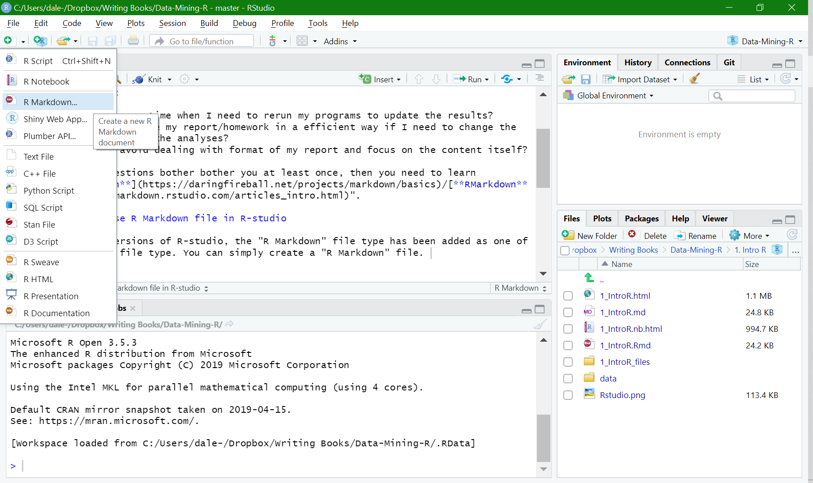
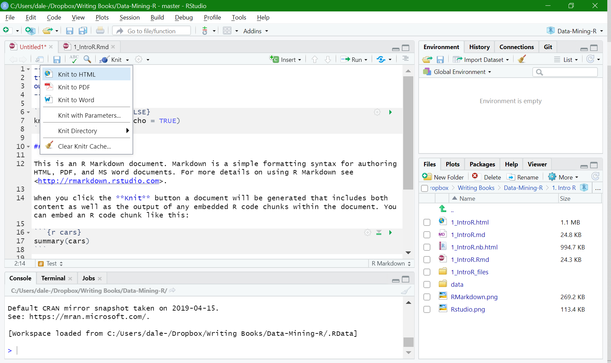

# Don't you want to improve your life? Let RMarkdown do the trick!

You may ask:

- How can I save time when I need to rerun my programs to update the results?
- How can I efficiently rewrite my report/homework if I need to change the data but keep all the analyses?
- How can I avoid dealing with the format of my report and focus on the content itself?

If these questions bother you at least once, then you need to learn "[**Markdown**](https://daringfireball.net/projects/markdown/basics)/[**RMarkdown**](https://rmarkdown.rstudio.com/articles_intro.html)".

## How to use R Markdown file in R-studio

The most recent version of R-studio has added the "R Markdown" file type as default. You can create an "R Markdown" file. 

The R Markdown file can generate three types of files as the report: HTML, pdf, and word. You can generate by clicking the "Knit" button as follows:

If everything goes correct, you will have the HTML/pdf/word file generated and popped-up. PS: the pdf file generating process require LaTex (such as [MikTex](https://miktex.org/)) installed. 

## Markdown Syntax: Simplest way of writing

1. headers - A single hashtag: first-level header. Two hashtags, `##`, creates a second-level header, and so on.

2. italicized and bold text - one asterisk, like this *without realizing it*. Two asterisks, like this, **easy to use**.

3. lists - Use asterisks or dash to create bullet points.

4. hyperlinks - create a hyperlink like this [Data-Mining](https://xiaoruizhu.github.io/Data-Mining-R/).

```
# Say Hello to **Data Mining** in Markdown

* [Data Mining in R on Github](https://xiaoruizhu.github.io/Data-Mining-R/)
* [Markdown Syntax](https://daringfireball.net/projects/markdown/basics)
* [StackOverflow](www.stackoverflow.com)
* [Reddit](www.reddit.com)

## R Markdown is a special type of Markdown in R
```

## How to communicate with codes? Use "knitr"

`knitr` is an R package that extends the markdown syntax. One of the most important functions of `knitr` is to include exectuable R code. Then, with the codes inside the paragraph, the technical report will be more readable than that not including codes. Besides, with `knitr`, the results of executed codes can be automatically included in the output report, which is a great feature. This feature makes your analyses "reproducible". In this way, you can easily change your codes. Then, when you `knit`, the the results in your output report will be updated with your new codes. 

> Here’s some code
> 
> ```{r}
> dim(iris)
> ```

> Here’s a plot
> 
> ```{r echo=FALSE}
> hist(iris[[2]])
> ```

More settings of the output of code chunks can be found [rmarkdown](https://bookdown.org/yihui/rmarkdown/r-code.html) and [knitr](https://yihui.org/knitr/options/) websites.

## Inline code 

To include some calculation by R code in a line, one can surround the codes as follows: 

> Two plus two equals `r 2+2`. (Use a pair of backticks and the letter r like this: \` r 2+2 \`)

[go to top](#header)
