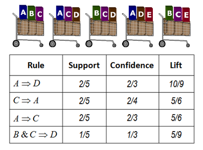

# Simple Example beforehand: T-shirts' Size

- How do the clothing companies decide the size of their T-shirt? 

- What size should a t-shirt be? 

- Everyone’s real t-shirt size is different, but how can they figure out the XS, S, M, L and XL labels?

At the first, they don't have these lables, they only have some information about customers. Let's think about how tailer make your customer-tailored T-shirt. They may measure your neck width(collar), arm length, chest width, waistline and so on. But they don't have any lable to make as fewer as possible sizes so that they can save cost. Let's say they only want to have five moduel. So the problem is how to find these five sizes so that most of the customers can buy a comfortable one, and meanwhile, when they have the right size, the T-shirt is not too large or to small. In statistics, this problem is equivalent to find five clusters based on provided information so that the variation within clusters is small, and between clusters variation is large. 

Add more visual graphs to illustrate the clustering. 

[go to top](#header)

# Summary of Seeds data

This tutorial illustrates the implentations of clustering and association rule mining in (R).

We use the seeds data set to demonstrate cluster analysis in R. The examined group comprised kernels belonging to three different varieties of wheat: Kama, Rosa and Canadian, 70 elements each. A description of the dataset can be viewed at (https://archive.ics.uci.edu/ml/datasets/seeds)

```{r setup, include=FALSE}
knitr::opts_chunk$set(echo = TRUE, eval = TRUE, message = FALSE, error = FALSE)
```

```{r}
seed = read.table('http://archive.ics.uci.edu/ml/machine-learning-databases/00236/seeds_dataset.txt', header=F)
seed = seed[,1:7]
colnames(seed) = c("area", "perimeter","campactness", "length", "width", "asymmetry", "groovelength")
```

Scale data to have zero mean and unit variance for each column
```{r}
seed <- scale(seed) 
```

[go to top](#header)

# K-means

The basic idea of k-means clustering is to define clusters then minimize the total intra-cluster variation (known as total within-cluster variation). The standard algorithm is the Hartigan-Wong algorithm (1979), which defines the total within-cluster variation as the **sum of squared distances Euclidean distances** between items and the corresponding centroid: $$W(C_k) = \sum_{x_i \in C_k}(x_i - \mu_k)^2,$$ where: 

- $x_i$ is a data point belonging to the cluster $C_k$
- $\mu_i$ is the mean value of the points assigned to the cluster $C_k$

For clustering, one can rely on all kinds of distance measures and it is critical point. The distance measures will show how similar two elements (x, y) are and it will highly influence the results of the clustering analysis. The classical methods for distance measures are Euclidean and Manhattan distances, which are defined as follow:

**Euclidean distance:**

$d_{euc}(x,y) = \sqrt{\sum^n_{i=1}(x_i - y_i)^2} \tag{1}$

**Manhattan distance:**

$d_{man}(x,y) = \sum^n_{i=1}|(x_i - y_i)| \tag{2}$

**Pearson correlation distance:**

$d_{cor}(x, y) = 1 - \frac{\sum^n_{i=1}(x_i-\bar x)(y_i - \bar y)}{\sqrt{\sum^n_{i=1}(x_i-\bar x)^2\sum^n_{i=1}(y_i - \bar y)^2}} \tag{3}$ 


In order to use k-means method for clustering and plot results, we can use `kmeans` function in R. It will group the data into a specified number of clusters (centers = 5). As mentioned before, the algorithm randomly k objects as the initial cluster centers to start the iteration, the final results may vary based on different initial centers. The `nstart` option of this function can allow the algorithm to attempt multiple initial configurations and reports on the best one. I recommended to set nstart for this function, which could give stable result. 

```{r}
library(factoextra)
distance <- get_dist(seed)
fviz_dist(distance, gradient = list(low = "#00AFBB", mid = "white", high = "#FC4E07"))
# K-Means Cluster Analysis
fit <- kmeans(seed, 2) #2 cluster solution
#Display number of clusters in each cluster
table(fit$cluster)
#Plot cluster in kmeans
```

```{r}
fit
fviz_cluster(fit, data = seed)
```


- `cluster`: A vector of integers (from 1:k) indicating the cluster to which each point is allocated.
- `centers`: A matrix of cluster centres.
- `totss`: 	The total sum of squares.
- `withinss`: Vector of within-cluster sum of squares, one component per cluster.
- `tot.withinss`: Total within-cluster sum of squares, i.e. sum(withinss).
- `betweenss`: The between-cluster sum of squares, i.e. totss-tot.withinss.
- `size`: The number of points in each cluster.
- `iter`: The number of (outer) iterations.
- `ifault`: integer: indicator of a possible algorithm problem – for experts.

We want to view the result so We can use `fviz_cluster`. It is function can provide a nice graph of the clusters. Usually, we have more than two dimensions (variables) `fviz_cluster` will perform principal component analysis (PCA) and plot the data points according to the first two principal components that explain the majority of the variance.

```{r}
fviz_cluster(fit, data = seed)
```

```{r}
k3 <- kmeans(seed, centers = 3, nstart = 25)
k4 <- kmeans(seed, centers = 4, nstart = 25)
k5 <- kmeans(seed, centers = 5, nstart = 25)

# plots to compare
p1 <- fviz_cluster(fit, geom = "point", data = seed) + ggtitle("k = 2")
p2 <- fviz_cluster(k3, geom = "point",  data = seed) + ggtitle("k = 3")
p3 <- fviz_cluster(k4, geom = "point",  data = seed) + ggtitle("k = 4")
p4 <- fviz_cluster(k5, geom = "point",  data = seed) + ggtitle("k = 5")

library(gridExtra)
grid.arrange(p1, p2, p3, p4, nrow = 2)
```

```{r, eval=FALSE}
install.packages("fpc")
```

```{r, message=FALSE, warning=FALSE}
library(fpc)
plotcluster(seed, fit$cluster)
```

```{r, eval=FALSE}
#See exactly which item are in 1st group
seed[fit$cluster==1,]
```
```{r}
#get cluster means for scaled data
aggregate(seed,by=list(fit$cluster),FUN=mean)
#or alternatively, use the output of kmeans
fit$centers
```

## Determine number of clusters
Here a simple within group sum of squares method is used. 

```{r}
# Determine number of clusters
wss <- (nrow(seed)-1)*sum(apply(seed,2,var))
for (i in 2:12) wss[i] <- sum(kmeans(seed,
                                     centers=i)$withinss)
plot(1:12, wss, type="b", xlab="Number of Clusters",ylab="Within groups sum of squares")
```

Prediction strength for estimating number of clusters. The prediction strength is defined according to Tibshirani and Walther (2005), who recommend to choose as optimal number of cluster the largest number of clusters that leads to a prediction strength above 0.8 or 0.9.

```{r}
prediction.strength(seed, Gmin=2, Gmax=15, M=10,cutoff=0.8)
```

fpc package has cluster.stat() function that can calcuate other cluster validity measures such as [Average Silhouette Coefficient](http://en.wikipedia.org/wiki/Silhouette_(clustering)) (between -1 and 1, the higher the better), or [Dunn index](http://en.wikipedia.org/wiki/Dunn_index) (betwen 0 and infinity, the higher the better):

```{r}
d = dist(seed, method = "euclidean")
result = matrix(nrow = 14, ncol = 3)
for (i in 2:15){
  cluster_result = kmeans(seed, i)
  clusterstat=cluster.stats(d, cluster_result$cluster)
  result[i-1,1]=i
  result[i-1,2]=clusterstat$avg.silwidth
  result[i-1,3]=clusterstat$dunn   
}
plot(result[,c(1,2)], type="l", ylab = 'silhouette width', xlab = 'number of clusters')
plot(result[,c(1,3)], type="l", ylab = 'dunn index', xlab = 'number of clusters')

```

The package `NbClust` provides 30 indexes for determining the optimal number of clusters in a data set.

For more sophiscated methods, see for example [blog](http://blog.echen.me/2011/03/19/counting-clusters/), or [course notes](http://www.bx.psu.edu/old/courses/bx-fall04/How_Many_Clusters.pdf).

[This article on Cross Validated](http://stats.stackexchange.com/a/133694/8622) provides a great illustration of the situations when k-means would fail.

[go to top](#header)

# Hierarchical clustering

```{r}
#Wards Method or Hierarchical clustering
#Calculate the distance matrix
seed.dist=dist(seed)
#Obtain clusters using the Wards method
seed.hclust=hclust(seed.dist, method="ward")
plot(seed.hclust)
#Cut dendrogram at the 3 clusters level and obtain cluster membership
seed.3clust = cutree(seed.hclust,k=3)
```

```{r, eval=FALSE}
#See exactly which item are in third group
seed[seed.3clust==3,]
```

```{r, eval=FALSE}
#get cluster means for raw data
#Centroid Plot against 1st 2 discriminant functions
#Load the fpc library needed for plotcluster function
library(fpc)
#plotcluster(ZooFood, fit$cluster)
plotcluster(seed, seed.3clust)
```

[go to top](#header)

# (Optional) Model-Based Cluster Analysis
A newer clustering appraoch, model-based cluster, treats the clustering problem as maximizing a Normal mixture model. Generating an observation in this model consists of first picking a centroid (mean of a multivariate normal distribution) at random and then adding some noise (variances). If the noise is normally distributed, this procedure will result in clusters of spherical shape. Model-based clustering assumes that the data were generated by a model and tries to recover the original model from the data. The model that we recover from the data then defines clusters and an assignment of documents to clusters. It can be thought as a generalization of  $K$-means. 

The model "recovering" process is done via Expectation-Maximization(EM) algorithm. It is an iterative approach to maximize the likelihood of a statistical model when the model contains unobserved variables.

One obvious advantage of the approach is that we can treat the question "How Many Clusters?" as a model selection problem.

For detailed description of the method and the package, see [1](http://www.stat.washington.edu/raftery/Research/mbc.html) and [2](http://www.stat.washington.edu/mclust/)


```{r, eval = FALSE}
install.packages('mclust')
```

```{r, warning = FALSE}
library(mclust)
```


```{r, warning = FALSE}
mclust_result = Mclust(seed)

```

```{r, warning = FALSE}
summary(mclust_result)
```

The BIC used in the package is the negative of the 'usual' BIC when we discussed regression models. Therefore we are trying to maximize the BIC here.

```{r, warning = FALSE}
plot(mclust_result)
```


[go to top](#header)


# Association Rules

<a id="arules"></a>

Association Rules is a popular and well researched method for discovering interesting relations between variables in large databases. *arules* package in R provides a basic infrastructure for creating and manipulating input data sets and for analyzing the resulting itemsets and rules. 

- For an introduction to arules and additional case studies see [Introduction to arules](http://cran.r-project.org/web/packages/arules/vignettes/arules.pdf)

- For the reference manual for the package see [arules package manual](http://cran.r-project.org/web/packages/arules/arules.pdf))


[Example](https://www.saedsayad.com/association_rules.htm): 
 

The Groceries data set contains 1 month (30 days) of real-world point-of-sale transaction data from a typical local grocery outlet. The data set contains 9835 transactions and the items are aggregated to 169 categories.
```{r}
library(arules)
data("Groceries")
```

```{r}
#run summary report
summary(Groceries)
```
 *summary()* displays the most frequent items in the data set, information about the transaction length distribution and that the data set contains some extended transaction information.
We see that the data set contains transaction IDs. This additional information can be used for analyzing the data
set. 

To find the very long transactions we can use the *size()* and select very long transactions (containing more than 30 items).

```{r}
#
x = Groceries[size(Groceries) > 30]
inspect(x)
```

To see which items are important in the data set we can use the *itemFrequencyPlot()*. To reduce the number of items, we only plot the item frequency for items with a support greater than 10%. The label size is reduced with the parameter *cex.names*.

```{r}
#
itemFrequencyPlot(Groceries, support = 0.1, cex.names=0.8)
```


Use *apriori()* algorithm to find all rules (the default association type for
*apriori()*) with a minimum support of 0.3% and a confidence of 0.5.
```{r}
# Run the apriori algorithm
basket_rules <- apriori(Groceries,parameter = list(sup = 0.003, conf = 0.5,target="rules"))

summary(basket_rules)
```
Recall from class:

- **Support**: The support of an itemset X or $latex supp(X)$ is defined as the proportion of transactions in the data set which contain the itemset. In the zoo data, the support for the rules is relatively low, with a maximum support of no more than 3%. 

- **Confidence**: The confidence of a rule is defined as $conf( X\Rightarrow Y) = supp( X \cup Y )/supp(X)$. For example, the rule {milk, bread} $\Rightarrow$ {butter} has a confidence of 0.5, which means that for 50% of the transactions containing milk and bread the rule is correct. Confidence can be interpreted as an estimate of the conditional probability P(Y |X), the probability of finding the RHS of the rule in transactions under the condition that these transactions also contain the LHS. Association rules are required to satisfy both a minimum support and a minimum confidence constraint at the same time.

- **Lift**: Lift is a popular measure of to filter or rank found rules. The lift of a rule is defined as $lift(X \Rightarrow Y ) = supp(X \cup Y )/(supp(X)supp(Y ))$. Lift can be interpreted as the deviation of the support of the whole rule from the support expected under independence given the supports of the LHS and the RHS. Greater lift values indicate stronger associations.

```{r}
# Check the generated rules using inspect
inspect(head(basket_rules))
```

As typical for association rule mining, the number of rules found is huge. To analyze these rules, for example, *subset()* can be used to produce separate subsets of rules. Now find the subset of rules that has 4 or more length (lhs+rhs).
```{r}
#Basket rules of size greater than 4
inspect(subset(basket_rules, size(basket_rules)>4))
```

Find the subset of rules with lift greater than 5:
```{r}
inspect(subset(basket_rules, lift>5))
```


Now find the subset rules that has Yogurt in the right hand side. Here we require *lift* measure exceeds 1.2.
```{r}
yogurt.rhs <- subset(basket_rules, subset = rhs %in% "yogurt" & lift>3.5)
```
Now inspect the subset rules
```{r}
inspect(yogurt.rhs)
```

Now find the subset rules that has Meat in the left hand side.
```{r}
meat.lhs <- subset(basket_rules, subset = lhs %in% "meat" & lift>1.5)
```
Now inspect the subset rules
```{r}
inspect(meat.lhs)
```

We can use the arulesViz package to visualize the rules, for a more complete introduction see (http://cran.r-project.org/web/packages/arulesViz/vignettes/arulesViz.pdf).

```{r, eval=FALSE}
install.packages('arulesViz')
```

```{r, message=FALSE}
library('arulesViz')
```

```{r}
plot(basket_rules)
```

The plot function has an interactive mode for you to inspect individual rules:
```{r, eval=FALSE}
plot(basket_rules, interactive=TRUE)
```

Graph-based visualization can be used for very small sets of rules. The vertices are represented by items for the 10 rules with highest lift:
```{r}
plot(head(sort(basket_rules, by="lift"), 10), method = "graph")
```

The package comes with an approach to cluster association rules and itemsets:
```{r}
plot(basket_rules, method="grouped")
```


[go to top](#header)

# Case Starter Code

<a id="case4"></a>

For problem 1 Iris data, simply use the Iris dataset in R. When doing cluster analysis for Iris you'll want to ignore the Species variable.

```{r, eval=FALSE}
data(iris)
```

For problem 2 Cincinnati Zoo data, use the following code to load the transaction data for association rules mining. *as()* function coerce the dataset into transaction data type for association rules mining.

```{r, eval=FALSE}
TransFood <- read.csv('https://xiaoruizhu.github.io/Data-Mining-R/data/food_4_association.csv')
TransFood <- TransFood[, -1]
# Find out elements that are not equal to 0 or 1 and change them to 1.
Others <- which(!(as.matrix(TransFood) ==1 | as.matrix(TransFood) ==0), arr.ind=T )
TransFood[Others] <- 1
TransFood <- as(as.matrix(TransFood), "transactions")
```
Load the data for clustering:
```{r, eval=FALSE}
Food_by_month <- read.csv('https://xiaoruizhu.github.io/Data-Mining-R/data/qry_Food_by_Month.csv')
```

[go to top](#header)
