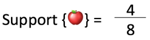
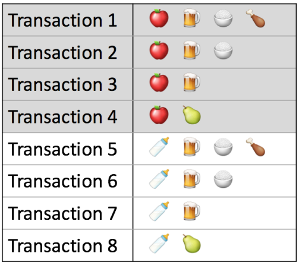
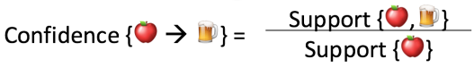
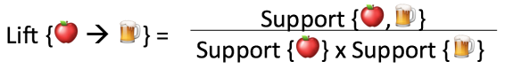

# Association Rules

<a id="arules"></a>

Association Rules is a popular and well researched method for discovering interesting relations between itemsets in large databases. We start from defining a few ways to measure association. 

1. **Support**: The support, $\text{supp}(X)$, measures how popular an *itemset* ($X$) is. It is calculated as the proportion of transactions in the data set which contain the itemset. 
    
    - We use Table 1[^1] below to show that the support of {apple} is 4 out of 8, or 50%. Itemsets can also contain multiple items. For instance, the support of {apple, beer, rice} is 2 out of 8, or 25%. The support of {apple, beer} is 3 out of 8. 

[^1]: The figures above are borrowed from [kdnuggets.com](https://www.kdnuggets.com/2016/04/association-rules-apriori-algorithm-tutorial.html).

<center>

</center>

<center>

</center>


2. **Confidence**: The confidence of a rule measures how likely item $Y$ is purchased when item $X$ is purchased, defined as $\text{conf}( X\Rightarrow Y) = \text{supp}( X \cap Y )/\text{supp}(X)$. This is measured by the proportion of transactions with item $X$, in which item $Y$ also appears. 

    - In Table 1, the confidence of {apple $\Rightarrow$ beer} is 3 out of 4, or 75%. It means that for 75% of the transactions containing apple the rule is correct (you will see apple and beer appear together). Confidence can be interpreted as an estimate of the conditional probability P(Y|X), the probability of finding the RHS of the rule in transactions under the condition that these transactions also contain the LHS. Association rules are required to satisfy both a minimum support and a minimum confidence constraint at the same time.

<center>

</center>

3. **Lift**: Lift is a popular measure of to filter or rank found rules. It measures how likely item $Y$ is purchased when item $X$ is purchased, while controlling for how popular item Y is, which is defined as $\text{lift}(X \Rightarrow Y ) = \text{supp}(X \cap Y )/(\text{supp}(X)\text{supp}(Y))$. Lift can be interpreted as the deviation of the support of the whole rule from the support expected under independence given the supports of the LHS and the RHS. Greater than 1 lift values  indicate stronger associations. 

    - In Table 1, the lift of {apple -> beer} is $\frac{3/8}{(4/8)\cdot(6/8)}=1$, which implies no association between items. A lift value greater than 1 means that item $Y$ is likely to be bought if item $X$ is bought, while a value less than 1 means that item $Y$ is unlikely to be bought if item $X$ is bought.

<center>

</center>

For more introductions, see [Complete guide to Association Rules 1](https://towardsdatascience.com/association-rules-2-aa9a77241654) and [Complete guide to Association Rules 2](https://towardsdatascience.com/complete-guide-to-association-rules-2-2-c92072b56c84). 


<!--  -->

<!-- [Example](https://www.saedsayad.com/association_rules.htm):  -->
<!--   -->

## Groceries example 

### Find association rules by *arules* package

The Groceries dataset contains 1 month (30 days) of real-world point-of-sale transaction data from a typical local grocery outlet. The data set contains 9835 transactions and the items are aggregated to 169 categories.

`arules` package in R provides a basic infrastructure for creating and manipulating input data sets and for analyzing the resulting itemsets and rules. 

- For an introduction to arules and additional case studies, see [Introduction to arules](http://cran.r-project.org/web/packages/arules/vignettes/arules.pdf).

- For the reference manual of the package, see [arules package manual](http://cran.r-project.org/web/packages/arules/arules.pdf).

```{r message=FALSE}
library(arules)
data("Groceries")
```

```{r}
#run summary report
summary(Groceries)
```

`summary()` displays the most frequent items in the data set, information about the transaction length distribution and that the data set contains some extended transaction information.
We see that the data set contains transaction IDs. This additional information can be used for analyzing the data
set. 

To find the very long transactions we can use the `size()` and select very long transactions (containing more than 30 items).

```{r}
# size() can specify size of items in transactions
x = Groceries[size(Groceries) > 30]
inspect(x)
```

To see which items are important in the data set we can use the `itemFrequencyPlot()`. To reduce the number of items, we only plot the item frequency for items with a support greater than 10%. The label size is reduced with the parameter `cex.names`.

```{r}
# itemFrequencyPlot() shows the frequency for items
itemFrequencyPlot(Groceries, support = 0.1, cex.names=0.8)
```

Use `apriori()` algorithm to find all rules (the default association type for `apriori()`) with a minimum support of 0.3% and a confidence of 0.5.
```{r}
# Run the apriori algorithm
basket_rules <- apriori(Groceries,parameter = list(sup = 0.003, conf = 0.5,target="rules"))

summary(basket_rules)
```

```{r}
# Check the generated rules using inspect
inspect(head(basket_rules))
```

As typical for association rule mining, the number of rules found is huge. To analyze these rules, for example, `subset()` can be used to produce separate subsets of rules. Now find the subset of rules that has 4 or more length (LHS+RHS).
```{r}
#Basket rules of size greater than 4
inspect(subset(basket_rules, size(basket_rules)>4))
```

Find the subset of rules with lift greater than 5:
```{r}
inspect(subset(basket_rules, lift>5))
```


Now find the subset rules that has Yogurt in the right hand side. Here we require **lift** measure exceeds 3.5.
```{r}
yogurt.rhs <- subset(basket_rules, subset = rhs %in% "yogurt" & lift>3.5)
```
Now inspect the subset rules
```{r}
inspect(yogurt.rhs)
```

Now find the subset rules that has Meat in the left hand side. Here we require **lift** measure exceeds 2.
```{r}
meat_lhs <- subset(basket_rules, subset = lhs %in% "meat" & lift>2)
```
Now inspect the subset rules
```{r}
inspect(meat_lhs)
```

### Visualize the rules by *arulesViz*

We can use the `arulesViz` package to visualize the rules, for a more complete introduction, see the [package manual](http://cran.r-project.org/web/packages/arulesViz/vignettes/arulesViz.pdf).

```{r, eval=FALSE}
install.packages('arulesViz')
```

```{r, message=FALSE}
library('arulesViz')
```

```{r}
plot(basket_rules)
```

The plot function has an interactive mode for you to inspect individual rules:
```{r, eval=FALSE}
plot(basket_rules, interactive=TRUE)
```

Graph-based visualization can be used for very small sets of rules. The vertices are represented by items for the 10 rules with highest lift:
```{r}
plot(head(sort(basket_rules, by="lift"), 10), method = "graph")
```

The package comes with an approach to cluster association rules and itemsets:
```{r}
plot(basket_rules, method="grouped")
```

[go to top](#header)

# Case Starter Code

<a id="case4"></a>

For Cincinnati Zoo data, use the following code to load the transaction data for association rules mining. `as()` function coerce the dataset into transaction data type for association rules mining. In the zoo data, the support for the rules is relatively low, with a minimum support of no more than 3%. 


```{r, eval=FALSE}
TransFood <- read.csv('https://xiaoruizhu.github.io/Data-Mining-R/data/food_4_association.csv')
TransFood <- TransFood[, -1]
# Find out elements that are not equal to 0 or 1 and change them to 1.
Others <- which(!(as.matrix(TransFood) ==1 | as.matrix(TransFood) ==0), arr.ind=T )
TransFood[Others] <- 1
TransFood <- as(as.matrix(TransFood), "transactions")
```

[go to top](#header)
