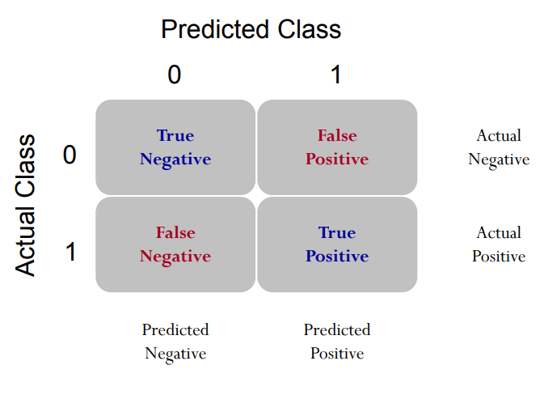
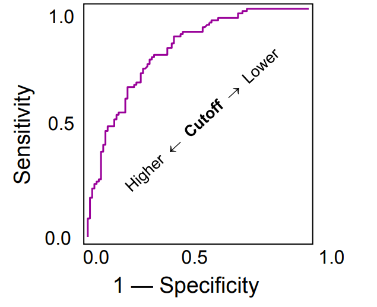

# Credit Card Default Data

We will use a Credit Card Default Data for this lab and illustration. The details of the data can be found at http://archive.ics.uci.edu/ml/datasets/default+of+credit+card+clients. 
Think about what kind of factors could affect people to fail to pay their credit balance.

We first load the credit scoring data. It is easy to load comma-separated values (CSV). 
```{r}
credit.data <- read.csv(file = "https://xiaoruizhu.github.io/Data-Mining-R/lecture/data/credit_default.csv", header=T)
```

Look at what information do we have.
```{r}
colnames(credit.data)
```

Let's look at how many people were actually default in this sample.
```{r}
mean(credit.data$default.payment.next.month)
```

The name of response variable is too long! I want to make it shorter by renaming. Recall the `rename()` function.
```{r message=FALSE}
library(dplyr)
credit.data<- rename(credit.data, default=default.payment.next.month)
```

How about the variable type and summary statistics?
```{r eval=FALSE}
str(credit.data)    # structure - see variable type
summary(credit.data) # summary statistics
```

We see all variables are **int**, but we know that *SEX, EDUCATION, MARRIAGE* are categorical, we convert them to **factor**.
```{r}
credit.data$SEX<- as.factor(credit.data$SEX)
credit.data$EDUCATION<- as.factor(credit.data$EDUCATION)
credit.data$MARRIAGE<- as.factor(credit.data$MARRIAGE)
```

*We omit other EDA, but you shouldn't whenever you are doing data analysis.*

[go to top](#header)


# Logistic Regression

Randomly split the data to training (80%) and testing (20%) datasets:
```{r}
index <- sample(nrow(credit.data),nrow(credit.data)*0.80)
credit.train = credit.data[index,]
credit.test = credit.data[-index,]
```

## Train a logistic regression model with all variables

```{r, warning=FALSE}
credit.glm0<- glm(default~., family=binomial, data=credit.train)
summary(credit.glm0)
```

You have seen `glm()` before. In this lab, this is the main function used to build logistic regression model because it is a member of generalized linear model. In `glm()`, the only thing new is `family`. It specifies the distribution of your response variable. You may also specify the link function after the name of distribution, for example, `family=binomial(logit)` (default link is logit). You can also specify `family=binomial(link = "probit")` to run probit regression. You may also use `glm()` to build many other generalized linear models.

## Prediction

Similar to linear regression, we use `predict()` function for prediction. 

To get prediction from a logistic regression model, there are several steps you need to understand. Refer to textbook/slides for detailed math.

1.The fitted model $\hat{\eta} = b_0 +b_1 x_1 + b_2 x_2 + ...$ gives you the estimated value before the inverse of link (logit in case of logistic regression). In logistic regression the $\hat{\eta}$ are called **log odds ratio**, which is $\log(P(y=1)/(1-P(y=1)))$. In R you use the *predict()* function to get a vector of all in-sample $\hat{\eta}$ (for each training obs).

```{r, fig.width=6, fig.height=4, fig.align='center'}
hist(predict(credit.glm0))
```

2.For each $\hat{\eta}$, in order to get the P(y=1), we can apply the inverse of the link function (logit here) to $\hat{\eta}$. The equation is $P(y=1) =  1/ (1+exp(-\hat{\eta}))$. In R you use the *fitted()* function or *predict(,type="response") to get the **predicted probability** for each training ob.
```{r, fig.width=6, fig.height=4, fig.align='center'}
pred_resp <- predict(credit.glm0,type="response")
hist(pred_resp)
```

3.Last but not least, you want a binary classification decision rule. The default rule is if the fitted $P(y=1) > 0.5$ then $y = 1$. The value 0.5 is called **cut-off probability**. You can choose the cut-off probability based on mis-classification rate, cost function, etc. In this case, the cost function can indicate the trade off between the risk of giving loan to someone who cannot pay (predict 0, truth 1), and risk of rejecting someone who qualifys (predict 1, truth 0).

These tables illustrate the impact of choosing different cut-off probability. Choosing a large cut-off probability will result in few cases being predicted as 1, and chossing a small cut-off probability will result in many cases being predicted as 1.

```{r}
table(predict(credit.glm0,type="response") > 0.5)
table(predict(credit.glm0,type="response") > 0.2)
table(predict(credit.glm0,type="response") > 0.0001)
```

### In-sample prediction (less important)
```{r}
pred.glm0.train<- predict(credit.glm0, type="response")
```

(**IMPORTANT!!!**) You have to specify `type="response"` in order to get probability outcome, which is what we want. Otherwise, what it produces is the linear predictor term $\beta_0+\beta_1X_1+\beta_2X_2+\dotso$. Recall the lecture, how is this linear predictor related to probability?

#### ROC Curve

In order to show give an overall measure of goodness of classification, using the Receiver Operating Characteristic (ROC) curve is one way. Rather than use an overall misclassification rate, it employs two measures – true positive fraction (TPF) and false positive fraction (FPF). 

True positive fraction, $\text{TPF}=\frac{\text{TP}}{\text{TP+FN}}$: is the proportion of true positives correctly predicted as positive.

False positive fraction, $\text{FPF}=\frac{\text{FP}}{\text{FP+TN}}=1-\frac{\text{TN}}{\text{FP+TN}}$: is the proportion of true negatives incorrectly predicted as positive.

<kbd>{width=45%}</kbd> <kbd>{width=45%} </kbd>

```{r, eval=FALSE}
install.packages('ROCR')
```
```{r, message=FALSE, warning=FALSE, fig.width=6, fig.height=5, fig.align='center'}
library(ROCR)
pred <- prediction(pred.glm0.train, credit.train$default)
perf <- performance(pred, "tpr", "fpr")
plot(perf, colorize=TRUE)
#Get the AUC
unlist(slot(performance(pred, "auc"), "y.values"))
```

Be careful that the function `prediction()` is different from `predict()`. It is in Package `ROCR`, and is particularly used for preparing for ROC curve. Recall out lecture, this function basically calculates many confusion matrices with different cut-off probability. Therefore, it requires two vectors as inputs -- **predicted probability** and **observed response (0/1)**. The next line, `performance()` calculates TPR and FPR based all confusion matrices you get from previous step. Then you can simply draw the ROC curve, which is a curve of FPR vs. TPR. The last line is to get AUC (area under the curve). I would recommend you to stick these four lines of code together, and use it to get ROC curve and AUC. If you don't want to draw the ROC curve (because it takes time), just comment out plot line.


### Out-of-sample prediction (more important)
```{r}
pred.glm0.test<- predict(credit.glm0, newdata = credit.test, type="response")
```

For out-of-sample prediction, you have to specify `newdata="testing sample name"`.

#### ROC Curve
```{r, message=FALSE, warning=FALSE, fig.width=6, fig.height=5, fig.align='center'}
pred <- prediction(pred.glm0.test, credit.test$default)
perf <- performance(pred, "tpr", "fpr")
plot(perf, colorize=TRUE)
#Get the AUC
unlist(slot(performance(pred, "auc"), "y.values"))
```

### (Optional) Precision-Recall Curve

Precision and recall curve and its AUC is more appropriate for imbalanced data. We use package `PRROC` to draw the PR curve. It can also draw the ROC curve. More details of the package can be found [here](https://cran.r-project.org/web/packages/PRROC/vignettes/PRROC.pdf).

```{r eval=FALSE}
install.packages("PRROC")
```
```{r message=FALSE, warning=FALSE, figures-side, fig.show="hold", out.width="50%"}
library(PRROC)
score1= pred.glm0.train[credit.train$default==1]
score0= pred.glm0.train[credit.train$default==0]
roc= roc.curve(score1, score0, curve = T)
roc$auc
pr= pr.curve(score1, score0, curve = T)
pr
plot(pr, main="In-sample PR curve")

# Out-of-sample prediction: 
score1.test= pred.glm0.test[credit.test$default==1]
score0.test= pred.glm0.test[credit.test$default==0]
roc.test= roc.curve(score1.test, score0.test, curve = T)
roc.test$auc
pr.test= pr.curve(score1.test, score0.test, curve = T)
pr.test
plot(pr.test, main="Out-of-sample PR curve")
```

# Summary

## Things to remember

* Know how to use glm() to build logistic regression;

* Know how to get ROC and AUC based on predicted probability;

* Know how to get PR curve and AUC based on predicted probability;

## Guide for Assignment

* EDA

* Train logistic model

* Prediction (ROC, AUC; PR, AUC)

* Model comparison using AUC

[go to top](#header)
