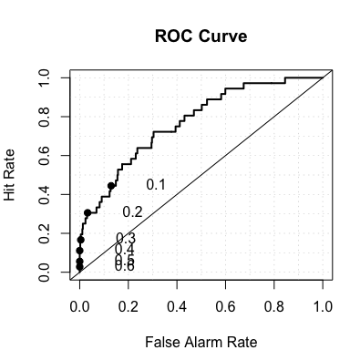
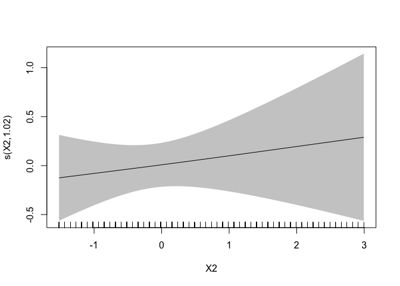
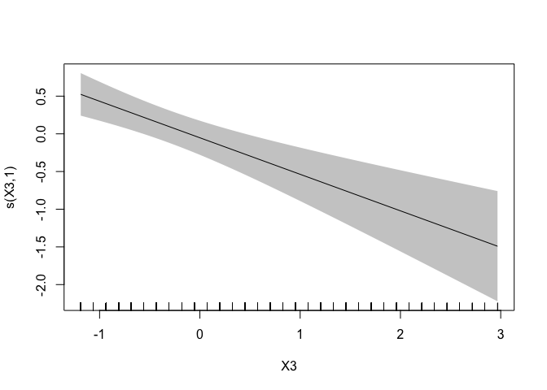
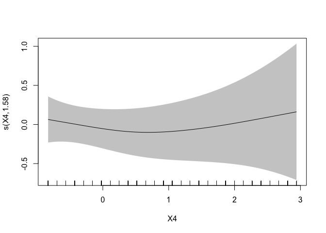
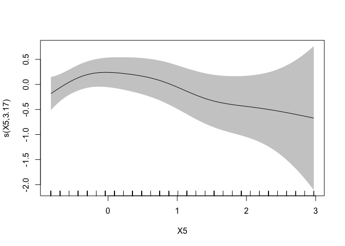

# Other Supervised Learning Methods


# Objective

This tutorial helps you to review various supervised learning techniques, introduce GAM, Neural Networks models, etc., and prepare you to finish Case Study 1.

# Credit Score Data
## Load Data


```r
credit.data <- read.csv("http://homepages.uc.edu/~maifg/7040/credit0.csv", header=T)
```

We remove X9 and id from the data since we will not be using them for prediction.

```r
credit.data$X9 = NULL
credit.data$id = NULL
credit.data$Y = as.factor(credit.data$Y)
```

Now split the data 90/10 as training/testing datasets:

```r
id_train <- sample(nrow(credit.data),nrow(credit.data)*0.90)
credit.train = credit.data[id_train,]
credit.test = credit.data[-id_train,]
```

The training dataset has 61 variables, 4500 obs. 

You are already familiar with the credit scoring set. Let's define a cost function for benchmarking testing set performance. Note this is slightly different from the one we used for searching for optimal cut-off probability in logistic regression. Here the 2nd argument is the predict class instead of the predict probability (since many methods are not based on predict probability).


```r
creditcost <- function(observed, predicted){
  weight1 = 10
  weight0 = 1
  c1 = (observed==1)&(predicted == 0) #logical vector - true if actual 1 but predict 0
  c0 = (observed==0)&(predicted == 1) #logical vector - true if actual 0 but predict 1
  return(mean(weight1*c1+weight0*c0))
}
```

[go to top](#content)

[go to top](#header)

# Generalized Linear Models (Logistic Regression)

Let's build a logistic regression model based on all X variables. Note id is excluded from the model.


```r
credit.glm0<-glm(Y~., family=binomial,credit.train)
```

You can view the result of the estimation:

```r
summary(credit.glm0)
```

The usual stepwise variable selection still works for logistic regression. **caution: this will take a very long time**.


```r
credit.glm.step <- step(credit.glm0,direction=c("both")) 
```

Or you can try model selection with BIC:


```r
credit.glm.step <- step(credit.glm0, k=log(nrow(credit.train)),direction=c("both")) 
```

Are there better ways of doing variable selection for genearlized linear models? Yes! (And you should probably know about it.) Check the optional lab notes on _Lasso variable selection_ and Section 3.4 of the textbook "Elements of Statistical Learning".

If you want a sneak peek on how to use Lasso for this dataset here it is:


```r
install.packages('glmnet')
```


```r
library(glmnet)
lasso_fit = glmnet(x = as.matrix(credit.train[, 2:61]), y = credit.train[,1], family= "binomial", alpha = 1)
coef(lasso_fit, s = 0.02)
```

```
## 61 x 1 sparse Matrix of class "dgCMatrix"
##                         1
## (Intercept) -2.4006774039
## X2           .           
## X3          -0.0004954468
## X4           .           
## X5           .           
## X6           .           
## X7           .           
## X8          -0.3649979120
## X10_2        .           
## X11_2       -0.3173478501
## X12_2        .           
## X13_2        .           
## X14_2        .           
## X15_2        .           
## X15_3        .           
## X15_4        .           
## X15_5        .           
## X15_6        .           
## X16_2        .           
## X16_3        .           
## X16_4        .           
## X16_5        .           
## X16_6        .           
## X17_2        .           
## X17_3        .           
## X17_4        .           
## X17_5        .           
## X17_6       -0.1539984157
## X18_2        .           
## X18_3        .           
## X18_4        .           
## X18_5        .           
## X18_6        .           
## X18_7        .           
## X19_2        .           
## X19_3        .           
## X19_4        .           
## X19_5        .           
## X19_6        .           
## X19_7        .           
## X19_8        .           
## X19_9        .           
## X19_10       .           
## X20_2        .           
## X20_3        .           
## X20_4        .           
## X21_2        .           
## X21_3        .           
## X22_2        .           
## X22_3        .           
## X22_4        .           
## X22_5        .           
## X22_6        .           
## X22_7        .           
## X22_8        .           
## X22_9        0.0368584600
## X22_10       .           
## X22_11       .           
## X23_2        .           
## X23_3        .           
## X24_2        .
```
The _s_ parameter determines how many variables are included and you can use cross-validation to choose it.

## Prediction and Cross Validation Using Logistic Regression

## Performance on testing set
To do out-of-sample prediction you need to add the testing set as a second argument after the glm object. Remember to add type = "response", otherwise you will get the log odds and not the probability.


```r
prob.glm0.outsample <- predict(credit.glm0,credit.test,type="response")
predicted.glm0.outsample <-  prob.glm0.outsample> 0.2
predicted.glm0.outsample <- as.numeric(predicted.glm0.outsample)
table(credit.test$Y, predicted.glm0.outsample, dnn=c("Observed","Predicted"))
```

```
##         Predicted
## Observed   0   1
##        0 458  21
##        1  13   8
```

```r
mean(ifelse(credit.test$Y != predicted.glm0.outsample, 1, 0))
```

```
## [1] 0.068
```

```r
creditcost(credit.test$Y, predicted.glm0.outsample)
```

```
## [1] 0.302
```

## ROC Curve
To get the ROC curve you need to install the verification library.

```r
install.packages('verification')
```
To plot the ROC curve, the first argument of roc.plot is the vector with actual values "A binary observation (coded {0, 1 } )". The second argument is the vector with predicted probability. 

```r
library('verification')
```


```r
roc.plot(credit.test$Y == '1', prob.glm0.outsample)
```
To get the area under the ROC curve:

```r
roc.plot(credit.test$Y == '1', prob.glm0.outsample)$roc.vol
```

<!-- -->

```
##      Model      Area     p.value binorm.area
## 1 Model  1 0.7499751 5.23667e-05          NA
```


[go to top](#content)

# Generalized Additive Models (GAM)
There are two common implementations of GAMs in R.  The older version (originally made for S-PLUS) is available as the 'gam' package by Hastie and Tibshirani.  The newer version that we will use below is the 'mgcv' package from Simon Wood.  The basic modeling procedure for both packages is similar (the function is gam for both; be wary of having both libraries loaded at the same time), but the behind-the-scenes computational approaches differ, as do the arguments for optimization and the model output.  Expect the results to be slightly different when used with the same model structure on the same dataset.


```r
library(mgcv)
```

```
## Loading required package: nlme
```

```
## This is mgcv 1.8-16. For overview type 'help("mgcv-package")'.
```

```r
## Create a formula for a model with a large number of variables:
gam_formula <- as.formula(paste("Y~s(X2)+s(X3)+s(X4)+s(X5)+", paste(colnames(credit.train)[6:61], collapse= "+")))

credit.gam <- gam(formula = gam_formula, family=binomial,data=credit.train);
summary(credit.gam)
```

```
## 
## Family: binomial 
## Link function: logit 
## 
## Formula:
## Y ~ s(X2) + s(X3) + s(X4) + s(X5) + X6 + X7 + X8 + X10_2 + X11_2 + 
##     X12_2 + X13_2 + X14_2 + X15_2 + X15_3 + X15_4 + X15_5 + X15_6 + 
##     X16_2 + X16_3 + X16_4 + X16_5 + X16_6 + X17_2 + X17_3 + X17_4 + 
##     X17_5 + X17_6 + X18_2 + X18_3 + X18_4 + X18_5 + X18_6 + X18_7 + 
##     X19_2 + X19_3 + X19_4 + X19_5 + X19_6 + X19_7 + X19_8 + X19_9 + 
##     X19_10 + X20_2 + X20_3 + X20_4 + X21_2 + X21_3 + X22_2 + 
##     X22_3 + X22_4 + X22_5 + X22_6 + X22_7 + X22_8 + X22_9 + X22_10 + 
##     X22_11 + X23_2 + X23_3 + X24_2
## 
## Parametric coefficients:
##              Estimate Std. Error z value Pr(>|z|)    
## (Intercept) -3.259851   0.706293  -4.615 3.92e-06 ***
## X6           0.189718   0.111526   1.701 0.088923 .  
## X7          -0.395167   0.209876  -1.883 0.059720 .  
## X8          -2.232661   0.323823  -6.895 5.40e-12 ***
## X10_2       -0.148535   0.166798  -0.891 0.373193    
## X11_2       -0.849085   0.151739  -5.596 2.20e-08 ***
## X12_2       -0.391557   0.196724  -1.990 0.046548 *  
## X13_2        0.274092   0.155030   1.768 0.077063 .  
## X14_2       -0.332574   0.274907  -1.210 0.226368    
## X15_2        0.528172   0.241074   2.191 0.028458 *  
## X15_3        0.318171   0.292292   1.089 0.276358    
## X15_4        0.939822   0.313871   2.994 0.002751 ** 
## X15_5        0.363209   0.413932   0.877 0.380237    
## X15_6        0.961851   0.270165   3.560 0.000371 ***
## X16_2        0.392018   0.277758   1.411 0.158137    
## X16_3       -0.163450   0.275350  -0.594 0.552774    
## X16_4        0.190612   0.340711   0.559 0.575851    
## X16_5       -0.186785   0.275632  -0.678 0.497987    
## X16_6        0.005692   0.289422   0.020 0.984309    
## X17_2       -0.138409   0.246428  -0.562 0.574347    
## X17_3       -1.205564   0.308616  -3.906 9.37e-05 ***
## X17_4       -0.526409   0.267809  -1.966 0.049343 *  
## X17_5        0.634423   0.434426   1.460 0.144188    
## X17_6       -1.221469   0.170437  -7.167 7.68e-13 ***
## X18_2        0.237973   0.326842   0.728 0.466554    
## X18_3        0.391805   0.263097   1.489 0.136434    
## X18_4        0.949243   0.250562   3.788 0.000152 ***
## X18_5        0.721707   0.231907   3.112 0.001858 ** 
## X18_6        0.504715   0.285813   1.766 0.077414 .  
## X18_7        0.641482   0.301705   2.126 0.033488 *  
## X19_2        0.532568   0.363186   1.466 0.142545    
## X19_3        0.755817   0.304370   2.483 0.013020 *  
## X19_4        0.267754   0.517134   0.518 0.604622    
## X19_5        0.448019   0.410796   1.091 0.275444    
## X19_6        0.503218   0.455281   1.105 0.269033    
## X19_7        0.833717   0.427486   1.950 0.051143 .  
## X19_8       -1.126569   0.788034  -1.430 0.152833    
## X19_9        1.017405   0.553268   1.839 0.065930 .  
## X19_10       0.626899   0.340439   1.841 0.065556 .  
## X20_2       -0.079962   0.359088  -0.223 0.823784    
## X20_3       -0.039428   0.261811  -0.151 0.880295    
## X20_4        0.097672   0.178572   0.547 0.584406    
## X21_2        0.328361   0.414588   0.792 0.428351    
## X21_3        0.384482   0.218406   1.760 0.078340 .  
## X22_2       -0.390847   0.383858  -1.018 0.308579    
## X22_3       -0.036274   0.337103  -0.108 0.914310    
## X22_4       -0.078850   0.427094  -0.185 0.853527    
## X22_5       -0.007528   0.407408  -0.018 0.985258    
## X22_6       -0.142981   0.579117  -0.247 0.804990    
## X22_7        0.036922   0.365531   0.101 0.919542    
## X22_8        0.041494   0.348514   0.119 0.905227    
## X22_9        0.560387   0.307692   1.821 0.068568 .  
## X22_10      -1.518568   1.076838  -1.410 0.158478    
## X22_11       0.269611   0.333377   0.809 0.418673    
## X23_2        0.082703   0.205589   0.402 0.687483    
## X23_3       -0.179126   0.221942  -0.807 0.419617    
## X24_2        0.476307   0.295453   1.612 0.106935    
## ---
## Signif. codes:  0 '***' 0.001 '**' 0.01 '*' 0.05 '.' 0.1 ' ' 1
## 
## Approximate significance of smooth terms:
##         edf Ref.df Chi.sq  p-value    
## s(X2) 1.001  1.002  0.634    0.427    
## s(X3) 1.002  1.003 21.184 4.23e-06 ***
## s(X4) 1.953  2.448  1.515    0.446    
## s(X5) 2.957  3.687  7.117    0.126    
## ---
## Signif. codes:  0 '***' 0.001 '**' 0.01 '*' 0.05 '.' 0.1 ' ' 1
## 
## R-sq.(adj) =  0.117   Deviance explained = 18.8%
## UBRE = -0.59428  Scale est. = 1         n = 4500
```

```r
plot(credit.gam, shade=TRUE,,seWithMean=TRUE,scale=0)
```

<!-- --><!-- --><!-- --><!-- -->

Model AIC/BIC and mean residual deviance

```r
AIC(credit.gam)
```

```
## [1] 1825.722
```

```r
BIC(credit.gam)
```

```
## [1] 2235.518
```

```r
credit.gam$deviance
```

```
## [1] 1697.897
```

## In-sample fit performance
In order to see the in-sample fit performance, you may look into the confusion matrix by using commands as following. 


```r
pcut.gam <- .08
prob.gam.in<-predict(credit.gam,credit.train,type="response")
pred.gam.in<-(prob.gam.in>=pcut.gam)*1
table(credit.train$Y,pred.gam.in,dnn=c("Observed","Predicted"))
```

```
##         Predicted
## Observed    0    1
##        0 3352  869
##        1   99  180
```

Likewise, misclassification rate is another thing you can check:


```r
mean(ifelse(credit.train$Y != pred.gam.in, 1, 0))
```

```
## [1] 0.2151111
```

Training model AIC and BIC:

```r
AIC(credit.gam)
```

```
## [1] 1825.722
```

```r
BIC(credit.gam)
```

```
## [1] 2235.518
```

## Search for optimal cut-off probability

The following code does a grid search from pcut = 0.01 to pcut = 0.99 with the objective of minimizing overall cost in the training set. I am using an asymmetric cost function by assuming that giving out a bad loan cost 10 time as much as rejecting application from someone who can pay.


```r
#define the searc grid from 0.01 to 0.20
searchgrid = seq(0.01, 0.20, 0.01)
#result.gam is a 99x2 matrix, the 1st col stores the cut-off p, the 2nd column stores the cost
result.gam = cbind(searchgrid, NA)
#in the cost function, both r and pi are vectors, r=Observed, pi=predicted probability
cost1 <- function(r, pi){
  weight1 = 10
  weight0 = 1
  c1 = (r==1)&(pi<pcut) #logical vector - true if actual 1 but predict 0
  c0 = (r==0)&(pi>pcut) #logical vector - true if actual 0 but predict 1
  return(mean(weight1*c1+weight0*c0))
}

for(i in 1:length(searchgrid))
{
  pcut <- result.gam[i,1]
  #assign the cost to the 2nd col
  result.gam[i,2] <- cost1(credit.train$Y, predict(credit.gam,type="response"))
}
plot(result.gam, ylab="Cost in Training Set")
```

<!-- -->

```r
index.min<-which.min(result.gam[,2])#find the index of minimum value
result.gam[index.min,2] #min cost
```

```
##           
## 0.4124444
```

```r
result.gam[index.min,1] #optimal cutoff probability
```

```
## searchgrid 
##       0.09
```

## Out-of-sample fit performance

```r
pcut <-  result.gam[index.min,1] 
prob.gam.out<-predict(credit.gam,credit.test,type="response")
pred.gam.out<-(prob.gam.out>=pcut)*1
table(credit.test$Y,pred.gam.out,dnn=c("Observed","Predicted"))
```

```
##         Predicted
## Observed   0   1
##        0 403  76
##        1  11  10
```
mis-classifciation rate is

```r
mean(ifelse(credit.test$Y != pred.gam.out, 1, 0))
```

```
## [1] 0.174
```
Cost associated with misclassification is

```r
creditcost(credit.test$Y, pred.gam.out)
```

```
## [1] 0.372
```

[go to top](#content)


# Discriminant Analysis
Linear Discriminant Analysis (LDA) (in-sample and out-of-sample performance measure) is illustrated here. The following illustrate the usage of an arbitrary cut off probability.

## In-sample

```r
credit.train$Y = as.factor(credit.train$Y)
credit.lda <- lda(Y~.,data=credit.train)
prob.lda.in <- predict(credit.lda,data=credit.train)
pcut.lda <- .15
pred.lda.in <- (prob.lda.in$posterior[,2]>=pcut.lda)*1
table(credit.train$Y,pred.lda.in,dnn=c("Obs","Pred"))
```

```
##    Pred
## Obs    0    1
##   0 3864  357
##   1  165  114
```

```r
mean(ifelse(credit.train$Y != pred.lda.in, 1, 0))
```

```
## [1] 0.116
```

## Out-of-sample

```r
lda.out <- predict(credit.lda,newdata=credit.test)
cut.lda <- .12
pred.lda.out <- as.numeric((lda.out$posterior[,2]>=cut.lda))
table(credit.test$Y,pred.lda.out,dnn=c("Obs","Pred"))
```

```
##    Pred
## Obs   0   1
##   0 423  56
##   1  12   9
```

```r
mean(ifelse(credit.test$Y != pred.lda.out, 1, 0))
```

```
## [1] 0.136
```

```r
creditcost(credit.test$Y, pred.lda.out)
```

```
## [1] 0.352
```
[go to top](#content)


# Neural Networks Models
Neural Networks method (in-sample and out-of-sample performance measure) is illustrated here. The package [**nnet**](http://cran.r-project.org/web/packages/nnet/nnet.pdf) is used for this purpose.

__Note__: 

- For classification problems with nnet you need to code the response to _factor_ first. In addition you want to add type = "class" for _predict()_  function. 

- For regression problems add lineout = TRUE when training model. In addition, the response needs to be standardized to $[0, 1]$ interval.


```r
Boston.nnet<-nnet(medv~.,size=4,data=Boston,linout=TRUE)
```

## Training

```r
library(nnet)
```


```r
credit.nnet <- nnet(Y~., data=credit.train, size=1, maxit=500)
```

```
## # weights:  63
## initial  value 4416.814570 
## final  value 1045.959727 
## converged
```

## Out-of-sample Testing

```r
prob.nnet= predict(credit.nnet,credit.test)
pred.nnet = as.numeric(prob.nnet > 0.08)
table(credit.test$Y,pred.nnet, dnn=c("Observed","Predicted"))
```

```
##         Predicted
## Observed   0
##        0 479
##        1  21
```

```r
mean(ifelse(credit.test$Y != pred.nnet, 1, 0))
```

```
## [1] 0.042
```

```r
creditcost(credit.test$Y, pred.nnet)
```

```
## [1] 0.42
```


[go to top](#content)

# Support Vector Machine (SVM)

SVM is probably one of the best off-the-shelf classifiers for many of problems. It handles nonlinearity, is well regularized (avoids overfitting), have few parameters, and fast for large number of observations. It can be adapted to handle regression problems as well. You can read more about SVM in Chapter 12 of the textbook. 

The R package e1071 offers an interface to the most popular svm implementation libsvm. You should read more about the usage of the package in this short tutorial (http://cran.r-project.org/web/packages/e1071/vignettes/svmdoc.pdf).


```r
install.packages('e1071')
```


```r
library(e1071)
credit.svm = svm(Y ~ ., data = credit.train, cost = 1, gamma = 1/length(credit.train), probability= TRUE)
prob.svm = predict(credit.svm, credit.test, probability = TRUE)
prob.svm = attr(prob.svm, 'probabilities')[,2] #This is needed because prob.svm gives a 
pred.svm = as.numeric((prob.svm >= 0.08))
table(credit.test$Y,pred.svm,dnn=c("Obs","Pred"))
```

```
##    Pred
## Obs   0   1
##   0 403  76
##   1  11  10
```

```r
mean(ifelse(credit.test$Y != pred.svm, 1, 0))
```

```
## [1] 0.174
```

```r
creditcost(credit.test$Y, pred.svm)
```

```
## [1] 0.372
```

credit.svm = svm(Y ~ ., data = credit.train, cost = 1, gamma = 1/length(credit.train), probability= TRUE)
prob.svm = predict(credit.svm, credit.test)

[go to top](#content)

# Performance Comparisons
At last, after fitting several models, you may want to compare their in-sample and out-of-sample performances. The performance measures are illustrated in previous sections. In your report, you may want to put them in some table format. Note that not all measures are applicable. For example, I didn't find AIC/BIC or deviance for LDA models and Neural Network models. For tree models, *tree* package can give you mean residual deviance but not with *rpart* package. If you find either one of them, I would be interested to know.

## In-sample
You may compare the following
- AIC or BIC
- Mean Residual Deviance (for binary response) or Mean Square Error (for continuous response)
- Cost (asymmetric or symmetric)
- Misclassification Rate
- ROC curve or Area Under the Curve (AUC)

## Out-of-sample
- Cost
- Misclassification Rate
- ROC curve or Area Under the Curve (AUC)


## Symmetric Cost and Multiclass Problems
For classification tasks with symmetric costs many of functions can be simplified. You do not have to worry about the cut-off probability and can focus on the tuning parameters in each model (e.g. cost and gamma in SVM).

Different classifiers deal with multiclass classification differently. Logistic regression can be extended to multinomial logistic regression (using _multinom_ function). Many other binary classifiers can use an either "one-vs-all"(train N binary classifiers to distinguish each class from the rest) or "one-vs-one"(train C(N,2) binary classifiers for each possible pair of classes) approach to deal with multiple classes. 


```r
data(iris)
id_train <- sample(nrow(iris),nrow(iris)*0.80)
iris.train = iris[id_train,]
iris.test = iris[-id_train,]
iris.svm = svm(Species ~ ., data = iris.train)
table(iris.test$Species, predict(iris.svm, iris.test), dnn=c("Observed","Predicted"))
```

```
##             Predicted
## Observed     setosa versicolor virginica
##   setosa         10          0         0
##   versicolor      0         10         0
##   virginica       0          0        10
```


[go to top](#content)

# Starter code for German credit scoring
Refer to http://archive.ics.uci.edu/ml/datasets/Statlog+(German+Credit+Data)) for variable description. Notice that "It is worse to class a customer as good when they are bad (weight = 5), than it is to class a customer as bad when they are good (weight = 1)." Define your cost function accordingly!


```r
install.packages('caret')
```


```r
library(caret) #this package contains the german data with its numeric format
data(GermanCredit)
```

[go to top](#content)
