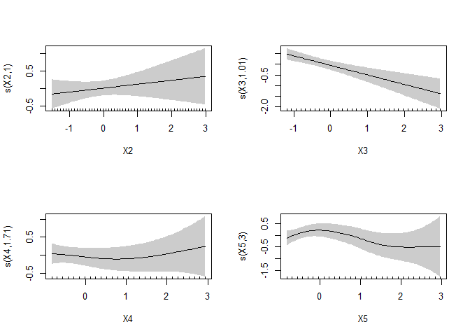
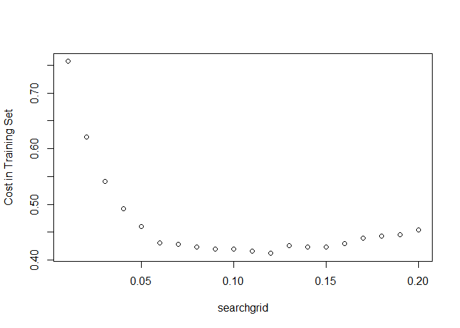

# Objective

This tutorial helps you to review various supervised learning techniques, introduce GAM, Neural Networks models, etc.

# Credit Score Data
## Load Data


```r
credit.data <- read.csv("data/credit0.csv", header=T)
```

We remove X9 and id from the data since we will not be using them for prediction.

```r
credit.data$X9 = NULL
credit.data$id = NULL
credit.data$Y = as.factor(credit.data$Y)
```

Now split the data 90/10 as training/testing datasets:

```r
id_train <- sample(nrow(credit.data),nrow(credit.data)*0.90)
credit.train = credit.data[id_train,]
credit.test = credit.data[-id_train,]
```

The training dataset has 61 variables, 4500 obs. 

You are already familiar with the credit scoring set. Let's define a cost function for benchmarking testing set performance. Note this is slightly different from the one we used for searching for optimal cut-off probability in logistic regression. Here the 2nd argument is the predict class instead of the predict probability (since many methods are not based on predict probability).


```r
creditcost <- function(observed, predicted){
  weight1 = 10
  weight0 = 1
  c1 = (observed==1)&(predicted == 0) #logical vector - true if actual 1 but predict 0
  c0 = (observed==0)&(predicted == 1) #logical vector - true if actual 0 but predict 1
  return(mean(weight1*c1+weight0*c0))
}
```

[go to top](#header)

# Generalized Additive Models (GAM)
There are two common implementations of GAMs in R.  The older version (originally made for S-PLUS) is available as the 'gam' package by Hastie and Tibshirani.  The newer version that we will use below is the 'mgcv' package from Simon Wood.  The basic modeling procedure for both packages is similar (the function is gam for both; be wary of having both libraries loaded at the same time), but the behind-the-scenes computational approaches differ, as do the arguments for optimization and the model output.  Expect the results to be slightly different when used with the same model structure on the same dataset.


```r
library(mgcv)

## Create a formula for a model with a large number of variables:
gam_formula <- as.formula(paste("Y~s(X2)+s(X3)+s(X4)+s(X5)+", paste(colnames(credit.train)[6:61], collapse= "+")))

credit.gam <- gam(formula = gam_formula, family=binomial,data=credit.train);
summary(credit.gam)
```

```
## 
## Family: binomial 
## Link function: logit 
## 
## Formula:
## Y ~ s(X2) + s(X3) + s(X4) + s(X5) + X6 + X7 + X8 + X10_2 + X11_2 + 
##     X12_2 + X13_2 + X14_2 + X15_2 + X15_3 + X15_4 + X15_5 + X15_6 + 
##     X16_2 + X16_3 + X16_4 + X16_5 + X16_6 + X17_2 + X17_3 + X17_4 + 
##     X17_5 + X17_6 + X18_2 + X18_3 + X18_4 + X18_5 + X18_6 + X18_7 + 
##     X19_2 + X19_3 + X19_4 + X19_5 + X19_6 + X19_7 + X19_8 + X19_9 + 
##     X19_10 + X20_2 + X20_3 + X20_4 + X21_2 + X21_3 + X22_2 + 
##     X22_3 + X22_4 + X22_5 + X22_6 + X22_7 + X22_8 + X22_9 + X22_10 + 
##     X22_11 + X23_2 + X23_3 + X24_2
## 
## Parametric coefficients:
##             Estimate Std. Error z value Pr(>|z|)    
## (Intercept) -3.45790    0.70446  -4.909 9.17e-07 ***
## X6           0.17696    0.11065   1.599 0.109742    
## X7          -0.44212    0.21435  -2.063 0.039150 *  
## X8          -2.07027    0.31561  -6.560 5.40e-11 ***
## X10_2       -0.19672    0.16629  -1.183 0.236817    
## X11_2       -0.90129    0.14997  -6.010 1.86e-09 ***
## X12_2       -0.39727    0.19240  -2.065 0.038944 *  
## X13_2        0.31402    0.15489   2.027 0.042626 *  
## X14_2       -0.29038    0.27825  -1.044 0.296673    
## X15_2        0.54733    0.23918   2.288 0.022116 *  
## X15_3        0.28702    0.28898   0.993 0.320601    
## X15_4        0.93887    0.31071   3.022 0.002514 ** 
## X15_5        0.34939    0.41566   0.841 0.400588    
## X15_6        0.90933    0.26845   3.387 0.000706 ***
## X16_2        0.47424    0.27507   1.724 0.084699 .  
## X16_3       -0.10180    0.27474  -0.371 0.711000    
## X16_4        0.16102    0.34563   0.466 0.641308    
## X16_5       -0.22584    0.27626  -0.817 0.413643    
## X16_6       -0.03841    0.29026  -0.132 0.894719    
## X17_2       -0.09612    0.24904  -0.386 0.699522    
## X17_3       -1.03158    0.30100  -3.427 0.000610 ***
## X17_4       -0.46219    0.27066  -1.708 0.087708 .  
## X17_5        0.74649    0.43143   1.730 0.083581 .  
## X17_6       -1.11081    0.16890  -6.577 4.81e-11 ***
## X18_2        0.22442    0.33114   0.678 0.497949    
## X18_3        0.44584    0.26494   1.683 0.092419 .  
## X18_4        0.93229    0.25520   3.653 0.000259 ***
## X18_5        0.71114    0.23672   3.004 0.002663 ** 
## X18_6        0.47080    0.29192   1.613 0.106792    
## X18_7        0.67853    0.30180   2.248 0.024557 *  
## X19_2        0.39907    0.35627   1.120 0.262652    
## X19_3        0.62476    0.29833   2.094 0.036244 *  
## X19_4        0.15601    0.51162   0.305 0.760411    
## X19_5        0.40858    0.41030   0.996 0.319343    
## X19_6        0.43077    0.44845   0.961 0.336769    
## X19_7        0.78680    0.41826   1.881 0.059955 .  
## X19_8       -0.81834    0.67186  -1.218 0.223218    
## X19_9        0.71063    0.55662   1.277 0.201711    
## X19_10       0.56539    0.33489   1.688 0.091359 .  
## X20_2        0.04750    0.34799   0.136 0.891434    
## X20_3        0.10350    0.26337   0.393 0.694326    
## X20_4        0.21919    0.17944   1.222 0.221895    
## X21_2        0.39649    0.41847   0.947 0.343395    
## X21_3        0.51317    0.21633   2.372 0.017687 *  
## X22_2       -0.28191    0.38945  -0.724 0.469136    
## X22_3        0.10998    0.33948   0.324 0.745972    
## X22_4        0.02983    0.43791   0.068 0.945693    
## X22_5       -0.13337    0.42839  -0.311 0.755557    
## X22_6        0.20734    0.55437   0.374 0.708390    
## X22_7        0.28658    0.35961   0.797 0.425497    
## X22_8        0.11763    0.34916   0.337 0.736201    
## X22_9        0.55871    0.31483   1.775 0.075955 .  
## X22_10      -1.35950    1.07458  -1.265 0.205820    
## X22_11       0.37944    0.33815   1.122 0.261819    
## X23_2        0.05999    0.20672   0.290 0.771657    
## X23_3       -0.21273    0.22116  -0.962 0.336102    
## X24_2        0.41120    0.30059   1.368 0.171318    
## ---
## Signif. codes:  0 '***' 0.001 '**' 0.01 '*' 0.05 '.' 0.1 ' ' 1
## 
## Approximate significance of smooth terms:
##         edf Ref.df Chi.sq  p-value    
## s(X2) 1.002  1.003  0.793   0.3745    
## s(X3) 1.006  1.011 19.168 1.24e-05 ***
## s(X4) 1.710  2.137  0.728   0.6526    
## s(X5) 3.000  3.741  7.539   0.0987 .  
## ---
## Signif. codes:  0 '***' 0.001 '**' 0.01 '*' 0.05 '.' 0.1 ' ' 1
## 
## R-sq.(adj) =  0.116   Deviance explained = 18.3%
## UBRE = -0.59073  Scale est. = 1         n = 4500
```

```r
plot(credit.gam, shade=TRUE,seWithMean=TRUE,scale=0, pages = 1)
```

<!-- -->

Model AIC/BIC and mean residual deviance

```r
AIC(credit.gam)
```

```
## [1] 1841.729
```

```r
BIC(credit.gam)
```

```
## [1] 2250.273
```

```r
credit.gam$deviance
```

```
## [1] 1714.295
```

## In-sample fit performance
In order to see the in-sample fit performance, you may look into the confusion matrix by using commands as following. 


```r
pcut.gam <- .08
prob.gam.in<-predict(credit.gam,credit.train,type="response")
pred.gam.in<-(prob.gam.in>=pcut.gam)*1
table(credit.train$Y,pred.gam.in,dnn=c("Observed","Predicted"))
```

```
##         Predicted
## Observed    0    1
##        0 3354  866
##        1  104  176
```

Likewise, misclassification rate is another thing you can check:


```r
mean(ifelse(credit.train$Y != pred.gam.in, 1, 0))
```

```
## [1] 0.2155556
```

Training model AIC and BIC:

```r
AIC(credit.gam)
```

```
## [1] 1841.729
```

```r
BIC(credit.gam)
```

```
## [1] 2250.273
```

## Search for optimal cut-off probability

The following code does a grid search from pcut = 0.01 to pcut = 0.99 with the objective of minimizing overall cost in the training set. I am using an asymmetric cost function by assuming that giving out a bad loan cost 10 time as much as rejecting application from someone who can pay.


```r
#define the searc grid from 0.01 to 0.20
searchgrid = seq(0.01, 0.20, 0.01)
#result.gam is a 99x2 matrix, the 1st col stores the cut-off p, the 2nd column stores the cost
result.gam = cbind(searchgrid, NA)
#in the cost function, both r and pi are vectors, r=Observed, pi=predicted probability
cost1 <- function(r, pi){
  weight1 = 10
  weight0 = 1
  c1 = (r==1)&(pi<pcut) #logical vector - true if actual 1 but predict 0
  c0 = (r==0)&(pi>pcut) #logical vector - true if actual 0 but predict 1
  return(mean(weight1*c1+weight0*c0))
}

for(i in 1:length(searchgrid))
{
  pcut <- result.gam[i,1]
  #assign the cost to the 2nd col
  result.gam[i,2] <- cost1(credit.train$Y, predict(credit.gam,type="response"))
}
plot(result.gam, ylab="Cost in Training Set")
```

<!-- -->

```r
index.min<-which.min(result.gam[,2])#find the index of minimum value
result.gam[index.min,2] #min cost
```

```
##           
## 0.4117778
```

```r
result.gam[index.min,1] #optimal cutoff probability
```

```
## searchgrid 
##       0.12
```

## Out-of-sample fit performance

```r
pcut <-  result.gam[index.min,1] 
prob.gam.out<-predict(credit.gam,credit.test,type="response")
pred.gam.out<-(prob.gam.out>=pcut)*1
table(credit.test$Y,pred.gam.out,dnn=c("Observed","Predicted"))
```

```
##         Predicted
## Observed   0   1
##        0 433  47
##        1  11   9
```
mis-classifciation rate is

```r
mean(ifelse(credit.test$Y != pred.gam.out, 1, 0))
```

```
## [1] 0.116
```
Cost associated with misclassification is

```r
creditcost(credit.test$Y, pred.gam.out)
```

```
## [1] 0.314
```

[go to top](#header)


# Discriminant Analysis
Linear Discriminant Analysis (LDA) (in-sample and out-of-sample performance measure) is illustrated here. The following illustrate the usage of an arbitrary cut off probability.

## In-sample

```r
library(MASS)
credit.train$Y = as.factor(credit.train$Y)
credit.lda <- lda(Y~.,data=credit.train)
prob.lda.in <- predict(credit.lda,data=credit.train)
pcut.lda <- .15
pred.lda.in <- (prob.lda.in$posterior[,2]>=pcut.lda)*1
table(credit.train$Y,pred.lda.in,dnn=c("Obs","Pred"))
```

```
##    Pred
## Obs    0    1
##   0 3872  348
##   1  161  119
```

```r
mean(ifelse(credit.train$Y != pred.lda.in, 1, 0))
```

```
## [1] 0.1131111
```

## Out-of-sample

```r
lda.out <- predict(credit.lda,newdata=credit.test)
cut.lda <- .12
pred.lda.out <- as.numeric((lda.out$posterior[,2]>=cut.lda))
table(credit.test$Y,pred.lda.out,dnn=c("Obs","Pred"))
```

```
##    Pred
## Obs   0   1
##   0 431  49
##   1  11   9
```

```r
mean(ifelse(credit.test$Y != pred.lda.out, 1, 0))
```

```
## [1] 0.12
```

```r
creditcost(credit.test$Y, pred.lda.out)
```

```
## [1] 0.318
```
[go to top](#header)


# Neural Networks Models
Neural Networks method (in-sample and out-of-sample performance measure) is illustrated here. The package [**nnet**](http://cran.r-project.org/web/packages/nnet/nnet.pdf) is used for this purpose.


## Regression

__Note__: 

- For regression problems add lineout = TRUE when training model. In addition, the response needs to be standardized to $[0, 1]$ interval. It's important normalize the response. If not, most of the times the algorithm will not converge. I chose to use the min-max method and scale the data in the interval [0,1]. 


```r
library(MASS)
maxs <- apply(Boston, 2, max) 
mins <- apply(Boston, 2, min)

scaled <- as.data.frame(scale(Boston, center = mins, scale = maxs - mins))
index <- sample(1:nrow(Boston),round(0.75*nrow(Boston)))

train_ <- scaled[index,]
test_ <- scaled[-index,]

library(neuralnet)
```

```
## Warning: package 'neuralnet' was built under R version 3.5.2
```


```r
n <- names(train_)
f <- as.formula(paste("medv ~", paste(n[!n %in% "medv"], collapse = " + ")))
nn <- neuralnet(f,data=train_,hidden=c(5,3),linear.output=T)
plot(nn)
```


```r
pr.nn <- compute(nn,test_[,1:13])

pr.nn_ <- pr.nn$net.result*(max(Boston$medv)-min(Boston$medv))+min(Boston$medv)
test.r <- (test_$medv)*(max(Boston$medv)-min(Boston$medv))+min(Boston$medv)
# MSE of testing set
MSE.nn <- sum((test.r - pr.nn_)^2)/nrow(test_)
MSE.nn
```

```
## [1] 8.731709
```

## Classification

__Note__: 

- For classification problems with nnet you need to code the response to _factor_ first. In addition you want to add type = "class" for _predict()_  function. 


```r
library(nnet)
```


```r
credit.nnet <- nnet(Y~., data=credit.train, size=1, maxit=500)
```

```
## # weights:  63
## initial  value 3196.694933 
## iter  10 value 939.939392
## iter  20 value 906.530265
## iter  30 value 900.665591
## iter  40 value 893.958833
## iter  50 value 890.045664
## iter  60 value 870.629320
## iter  70 value 862.276550
## iter  80 value 861.096522
## final  value 861.089955 
## converged
```


```r
prob.nnet= predict(credit.nnet,credit.test)
pred.nnet = as.numeric(prob.nnet > 0.08)
table(credit.test$Y,pred.nnet, dnn=c("Observed","Predicted"))
```

```
##         Predicted
## Observed   0   1
##        0 306 174
##        1   4  16
```

```r
mean(ifelse(credit.test$Y != pred.nnet, 1, 0))
```

```
## [1] 0.356
```

```r
creditcost(credit.test$Y, pred.nnet)
```

```
## [1] 0.428
```

[go to top](#header)

# Support Vector Machine (SVM)

SVM is probably one of the best off-the-shelf classifiers for many of problems. It handles nonlinearity, is well regularized (avoids overfitting), have few parameters, and fast for large number of observations. It can be adapted to handle regression problems as well. You can read more about SVM in Chapter 12 of the textbook. 

The R package e1071 offers an interface to the most popular svm implementation libsvm. You should read more about the usage of the package in this short tutorial (http://cran.r-project.org/web/packages/e1071/vignettes/svmdoc.pdf).


```r
install.packages('e1071')
```


```r
library(e1071)
```

```
## Warning: package 'e1071' was built under R version 3.5.2
```

```r
credit.svm = svm(Y ~ ., data = credit.train, cost = 1, gamma = 1/length(credit.train), probability= TRUE)
prob.svm = predict(credit.svm, credit.test, probability = TRUE)
prob.svm = attr(prob.svm, 'probabilities')[,2] #This is needed because prob.svm gives a matrix
pred.svm = as.numeric((prob.svm >= 0.08))
table(credit.test$Y,pred.svm,dnn=c("Obs","Pred"))
```

```
##    Pred
## Obs   0   1
##   0 391  89
##   1  10  10
```

```r
mean(ifelse(credit.test$Y != pred.svm, 1, 0))
```

```
## [1] 0.198
```

```r
creditcost(credit.test$Y, pred.svm)
```

```
## [1] 0.378
```

credit.svm = svm(Y ~ ., data = credit.train, cost = 1, gamma = 1/length(credit.train), probability= TRUE)
prob.svm = predict(credit.svm, credit.test)

[go to top](#header)

# Performance Comparisons
At last, after fitting several models, you may want to compare their in-sample and out-of-sample performances. The performance measures are illustrated in previous sections. In your report, you may want to put them in some table format. Note that not all measures are applicable. For example, I didn't find AIC/BIC or deviance for LDA models and Neural Network models. For tree models, *tree* package can give you mean residual deviance but not with *rpart* package. If you find either one of them, I would be interested to know.

## In-sample
You may compare the following
- AIC or BIC
- Mean Residual Deviance (for binary response) or Mean Square Error (for continuous response)
- Cost (asymmetric or symmetric)
- Misclassification Rate
- ROC curve or Area Under the Curve (AUC)

## Out-of-sample
- Cost
- Misclassification Rate
- ROC curve or Area Under the Curve (AUC)


## Symmetric Cost and Multiclass Problems

For classification tasks with symmetric costs many of functions can be simplified. You do not have to worry about the cut-off probability and can focus on the tuning parameters in each model (e.g. cost and gamma in SVM).

Different classifiers deal with multiclass classification differently. Logistic regression can be extended to multinomial logistic regression (using _multinom_ function). Many other binary classifiers can use an either "one-vs-all"(train N binary classifiers to distinguish each class from the rest) or "one-vs-one"(train C(N,2) binary classifiers for each possible pair of classes) approach to deal with multiple classes. 


```r
data(iris)
id_train <- sample(nrow(iris),nrow(iris)*0.80)
iris.train = iris[id_train,]
iris.test = iris[-id_train,]
iris.svm = svm(Species ~ ., data = iris.train)
table(iris.test$Species, predict(iris.svm, iris.test), dnn=c("Observed","Predicted"))
```

```
##             Predicted
## Observed     setosa versicolor virginica
##   setosa          9          0         0
##   versicolor      0         11         0
##   virginica       0          1         9
```


[go to top](#header)

# Starter code for German credit scoring
Refer to http://archive.ics.uci.edu/ml/datasets/Statlog+(German+Credit+Data)) for variable description. Notice that "It is worse to class a customer as good when they are bad (weight = 5), than it is to class a customer as bad when they are good (weight = 1)." Define your cost function accordingly!


```r
install.packages('caret')
```


```r
library(caret) #this package contains the german data with its numeric format
```

```
## Warning: package 'caret' was built under R version 3.5.2
```

```r
data(GermanCredit)
```

[go to top](#header)
