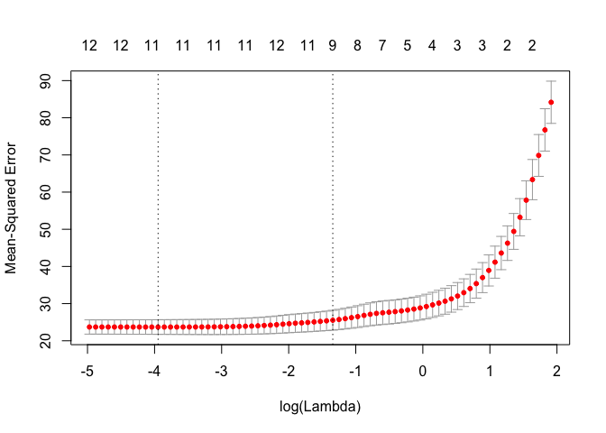

# Advanced Variable Selection Techniques


# Lasso and Elastic net 

Two of the state-of-the-art automatic variable selection techniques of predictive modeling , Lasso [1] and Elastic net [2], are provided in the _glmnet_ package. These method are in general better than the stepwise regressions, especially when dealing with large amount of predictor variables.

For a more theoretical review of these techniques refer to section 3.4 - 3.8 of ["Elements of Statistical Learning" (Free Online)](http://www-stat.stanford.edu/~tibs/ElemStatLearn/). For more details of the glmnet package you can watch [Professor Trevor Hastie's presentation](http://www.youtube.com/watch?v=BU2gjoLPfDc). 

In short, Lasso and Elastic net are solving this optimization problem [2] :

$$\begin{array}
{rl}
\hat{\beta}= & \underset{\beta}{argmin}|y-X\beta|^2_2 \\
subject to & (1-\alpha)|\beta|_1+\alpha|\beta|^2\le t
\end{array}$$

Note that when solving the above problem without the constraint we have a familiar least square regression model. When the constraint is added, depending on how large $t$ is, some of the "unimportant" predictor variables will become 0 and are forced out of the model. Lasso is a special case of Elastic net when $\alpha = 0$.

Two of the most important tuning parameters are $t$ and $\alpha$ in the above equation. 

- $t$ is controlled by adding the left hand side of the constraint as a penalty term in the objective. By default 100 different penalty parameter $\lambda$ are evaluated. When $\lambda$ is large less variables are included in the model. You can choose the $\lambda$ yourself if you know how many variables you want in the model or use cv.glmnet to conduct a cross-validation.

- The default $alpha = 1$ (the definition is the opposite of the above equation) gives Lasso penalty, which is fine in most cases.

The case for using elastic net is [3]: 

- Use elastic net when variables are highly correlated and you want to select more than one predictor variables from a group of correlated variables. Lasso tends to select one variable from a group and ignore the others.

- Use elastic net when there are more variables than observations.

Here we demonstrate Lasso on Boston Housing data. For parsimony we are not using training/testing split in this example.

Note: If you have a binary response you can use _family= "binomial"_ option in the glmnet() function. 


```r
library(MASS)
```


```r
data(Boston);
colnames(Boston) 
```

```
##  [1] "crim"    "zn"      "indus"   "chas"    "nox"     "rm"      "age"    
##  [8] "dis"     "rad"     "tax"     "ptratio" "black"   "lstat"   "medv"
```


```r
install.packages('glmnet')
```


```r
library(glmnet)
```

glmnet does not take data frame as input, so we have to specify the x matrix and y vector.


```r
lasso_fit = glmnet(x = as.matrix(Boston[, -c(which(colnames(Boston)=='medv'))]), y = Boston$medv, alpha = 1)
#lambda = 0.5
coef(lasso_fit,s=0.5)
```

```
## 14 x 1 sparse Matrix of class "dgCMatrix"
##                        1
## (Intercept) 14.177440438
## crim        -0.013381578
## zn           .          
## indus        .          
## chas         1.565138249
## nox         -0.014613711
## rm           4.237566863
## age          .          
## dis         -0.081500956
## rad          .          
## tax          .          
## ptratio     -0.739162698
## black        0.005955512
## lstat       -0.513806573
```

```r
#lambda = 1
coef(lasso_fit,s=1)
```

```
## 14 x 1 sparse Matrix of class "dgCMatrix"
##                        1
## (Intercept) 15.283205304
## crim         .          
## zn           .          
## indus        .          
## chas         0.074725983
## nox          .          
## rm           3.862575281
## age          .          
## dis          .          
## rad          .          
## tax          .          
## ptratio     -0.620249174
## black        0.001973097
## lstat       -0.496888716
```

```r
#use 5-fold cross validation to pick lambda
cv_lasso_fit = cv.glmnet(x = as.matrix(Boston[, -c(which(colnames(Boston)=='medv'))]), y = Boston$medv, alpha = 1, nfolds = 5)
plot(cv_lasso_fit)
```

<!-- -->

The best $\lambda$ (or _s_) is given by:

```r
cv_lasso_fit$lambda.min
```

```
## [1] 0.03073584
```

Given a selected _s_ you can use _predict()_ this way to get prediction:

```r
Boston.insample.prediction = predict(lasso_fit, as.matrix(Boston[, -c(which(colnames(Boston)=='medv'))]), s = cv_lasso_fit$lambda.min)
```


[1]: Tibshirani, R. (1996). Regression shrinkage and selection via the lasso. Journal of the Royal Statistical Society. Series B (Methodological), 267-288.
[2]: Zou, H., & Hastie, T. (2005). Regularization and variable selection via the elastic net. Journal of the Royal Statistical Society: Series B (Statistical Methodology), 67(2), 301-320.  
[3]: http://www.stanford.edu/~hastie/TALKS/enet_talk.pdf "Regularization and Variable Selection via the Elastic Net"
