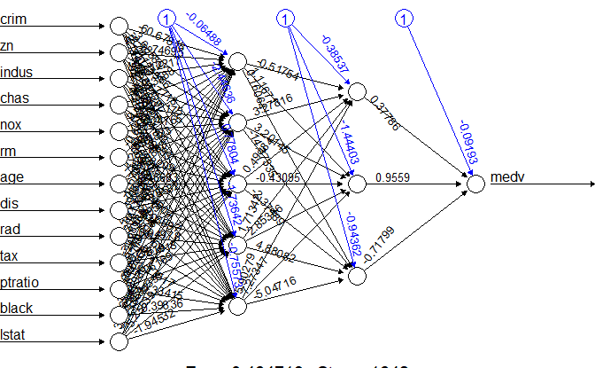
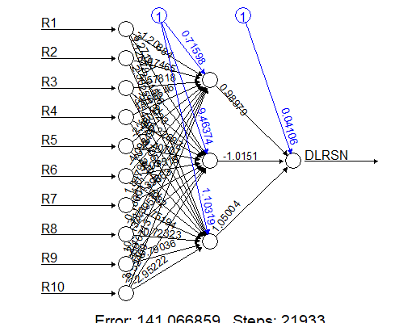

```{r setup, include=FALSE}
knitr::opts_chunk$set(echo = TRUE, eval = TRUE)
```

```{r library, eval=TRUE, echo=FALSE, results='hide', message=FALSE, warning=FALSE}
library(xtable)
library(glmnet)
```

# Neural Networks Models

Neural Networks method (in-sample and out-of-sample performance measure) is illustrated here. The package `neuralnet` and [**nnet**](http://cran.r-project.org/web/packages/nnet/nnet.pdf) are used for this purpose.

1.  `neuralnet` package

```{r, message=FALSE, echo=FALSE, eval=FALSE}
# Example
nn <- neuralnet(formula, data=train, hidden=c(5,3), linear.output=T)
```

The arguments:

-   hidden: a vector of integers specifying the number of hidden neurons (vertices) in each layer.
-   rep: the number of repetitions for the neural network's training.
-   startweights: a vector containing starting values for the weights. The weights will not be randomly initialized.
-   linear.output: TRUE for continuous response FALSE for categorical response.

2.  `nnet` package

```{r, message=FALSE, echo=FALSE, eval=FALSE}
# Example
Boston_nnet <- nnet(medv ~ . , size = 6, data = data, maxit=10000, decay=0.006, linout = TRUE)
```

The arguments:

-   size: number of units in the hidden layer.
-   maxit: maximum number of iterations. Default 100.
-   decay: parameter for weight decay. Default 0.
-   linout: TRUE for continuous response FALSE for categorical response (default)
-   weights: (case) weights for each example -- if missing defaults to 1.

## Regression

For regression problems, we use `neuralnet` and add `linear.output = TRUE` when training model. 
```{r, message=FALSE}
library(MASS)
data("Boston")
index <- sample(1:nrow(Boston),round(0.9*nrow(Boston)))

train_Boston <- Boston[index,]
test_Boston <- Boston[-index,]
```

-   **Plot the fitted neural network model**:

```{r, fig.width=7}
library(neuralnet)
f <- as.formula("medv ~ .")

# Or you can do the following way that is general and will ease your pain to manually update formula:
# resp_name <- names(train_Boston)
# f <- as.formula(paste("medv ~", paste(resp_name[!resp_name %in% "medv"], collapse = " + ")))

nn <- neuralnet(f,data=train_Boston, hidden=c(5,3), linear.output=T)
plot(nn)
```



-   **Calculate the MSE of the above neural network model**:

```{r}
pr_nn <- compute(nn, test_Boston[,1:13])

# MSPE of testing set
MSPE_nn <- sum((pr_nn$net.result - test_Boston$medv)^2)/nrow(test_Boston)
MSPE_nn
```


## Classification on Bankruptcy dataset

For classification problems, we use `neuralnet` and add `linear.output = FALSE` when training model. A common practice is again to scale/standardize predictor variables.

```{r echo=TRUE, message = FALSE,warning=FALSE, results='hide'}
Bank_data_scaled <- Bank_data <- 
  read.csv(file = "https://xiaoruizhu.github.io/Data-Mining-R/lecture/data/bankruptcy.csv", header=T)
# summary(Bank_data)
library(MASS)
maxs <- apply(Bank_data[,-c(1:3)], 2, max)
mins <- apply(Bank_data[,-c(1:3)], 2, min)
Bank_data_scaled[,-c(1:3)] <- as.data.frame(scale(Bank_data[,-c(1:3)], center = mins, scale = maxs - mins))

sample_index <- sample(nrow(Bank_data_scaled),nrow(Bank_data_scaled)*0.70)
Bank_train <- Bank_data_scaled[sample_index,]
Bank_test <- Bank_data_scaled[-sample_index,]
```

<kbd>{width="900px" height="720px"} </kbd>

```{r echo=TRUE, message=FALSE, warning=FALSE, out.height="100%", out.width="100%"}
library(neuralnet)
f <- as.formula("DLRSN ~ R1 + R2 + R3 + R4 + R5 + R6 + R7 + R8 + R9 + R10")
# You may need to specific the formula rather than 
Bank_nn <- neuralnet(f, data=Bank_train, hidden=c(3), algorithm = 'rprop+', linear.output=F, likelihood = T)
plot(Bank_nn)
```



-   **In-sample fit performance**

```{r}
pcut_nn <- 1/36
prob_nn_in <- predict(Bank_nn, Bank_train, type="response")
pred_nn_in <- (prob_nn_in>=pcut_nn)*1
table(Bank_train$DLRSN, pred_nn_in, dnn=c("Observed","Predicted"))
```

- **In-sample ROC Curve**

```{r, message=FALSE, warning=FALSE, fig.width=6, fig.height=5, fig.align='center'}
library(ROCR)
pred <- prediction(prob_nn_in, Bank_train$DLRSN)
perf <- performance(pred, "tpr", "fpr")
plot(perf, colorize=TRUE)
#Get the AUC
unlist(slot(performance(pred, "auc"), "y.values"))
```

- **Model AIC/BIC and mean residual deviance**

```{r}
Bank_nn$result.matrix[4:5,]
```

- **Out-of-sample fit performance**

```{r}
prob_nn_out <- predict(Bank_nn, Bank_test, type="response")
pred_nn_out <- (prob_nn_out>=pcut_nn)*1
table(Bank_test$DLRSN, pred_nn_out, dnn=c("Observed","Predicted"))
```

- **Out-of-sample ROC Curve**

```{r, message=FALSE, warning=FALSE, fig.width=6, fig.height=5, fig.align='center'}
pred <- prediction(prob_nn_out, Bank_test$DLRSN)
perf <- performance(pred, "tpr", "fpr")
plot(perf, colorize=TRUE)
#Get the AUC
unlist(slot(performance(pred, "auc"), "y.values"))
```


[go to top](#header)

<!-- ## Classification -->

<!-- __Note__: -->

<!-- - For classification problems with nnet you need to code the response to _factor_ first. In addition you want to add type = "class" for _predict()_  function. -->

<!-- ### Credit Scoring Data -->

<!-- ```{r} -->

<!-- credit_data <- read.csv(file = "https://xiaoruizhu.github.io/Data-Mining-R/lecture/data/credit_default.csv", header=T) -->

<!-- # rename -->

<!-- library(dplyr) -->

<!-- credit_data<- rename(credit_data, default=default.payment.next.month) -->

<!-- # convert categorical data to factor -->

<!-- credit_data$SEX<- as.factor(credit_data$SEX) -->

<!-- credit_data$EDUCATION<- as.factor(credit_data$EDUCATION) -->

<!-- credit_data$MARRIAGE<- as.factor(credit_data$MARRIAGE) -->

<!-- ``` -->

<!-- ```{r} -->

<!-- index <- sample(nrow(credit_data),nrow(credit_data)*0.90) -->

<!-- credit_train = credit_data[index,] -->

<!-- credit_test = credit_data[-index,] -->

<!-- ``` -->

<!-- You are already familiar with the credit scoring set. Let's define a cost function for benchmarking testing set performance. Note this is slightly different from the one we used for searching for optimal cut-off probability in logistic regression. Here the 2nd argument is the predict class instead of the predict probability (since many methods are not based on predict probability). -->

<!-- ```{r} -->

<!-- creditcost <- function(observed, predicted){ -->

<!--   weight1 <- 5 -->

<!--   weight0 <- 1 -->

<!--   c1 <- (observed==1)&(predicted == 0) #logical vector - true if actual 1 but predict 0 -->

<!--   c0 <- (observed==0)&(predicted == 1) #logical vector - true if actual 0 but predict 1 -->

<!--   return(mean(weight1*c1+weight0*c0)) -->

<!-- } -->

<!-- ``` -->

<!-- ```{r, message=FALSE} -->

<!-- library(nnet) -->

<!-- credit_nnet <- nnet(default~., data=credit_train, size=20, maxit=5000) -->

<!-- ``` -->

<!-- ```{r} -->

<!-- prob_nnet <- predict(credit_nnet, credit_test) -->

<!-- pred_nnet <- as.numeric(prob_nnet > 0.05) -->

<!-- table(credit_test$default,pred_nnet, dnn=c("Observed","Predicted")) -->

<!-- cat("Misclassification rate =", mean(ifelse(credit_test$default != pred_nnet, 1, 0))) -->

<!-- cat("Asymmetric cost (with ratio 10:1) =", creditcost(credit_test$default, pred_nnet)) -->

<!-- ``` -->

<!-- [go to top](#header) -->

## Some remarks

In practices, the normalization and standardization for predictors and response variable are recommended before training a neural network model. Otherwise, your neural network model may not be able to converge as the following case:
```{r, eval=FALSE, message=FALSE}
nn <- neuralnet(f, data=train_Boston, hidden=c(5), linear.output=T)
# Algorithm did not converge in 1 of 1 repetition(s) within the stepmax.
```

To illustrate, I chose to use the min-max method and scale the data in the interval $[0,1]$. Other reference online: [[1](https://machinelearningmastery.com/how-to-improve-neural-network-stability-and-modeling-performance-with-data-scaling/)]
```{r, eval=FALSE, message=FALSE}
# This is an illustration chunk, I do not run it.
maxs <- apply(Boston, 2, max) 
mins <- apply(Boston, 2, min)

scaled <- as.data.frame(scale(Boston, center = mins, scale = maxs - mins))
index <- sample(1:nrow(Boston),round(0.9*nrow(Boston)))

train_Boston <- scaled[index,]
test_Boston <- scaled[-index,]
n <- names(train_Boston)
f <- as.formula(paste("medv ~", paste(n[!n %in% "medv"], collapse = " + ")))
nn_try <- neuralnet(f,data=train_Boston, hidden=c(5,3), linear.output=T)

pr_nn_try <- compute(nn_try, test_Boston[,1:13])

# recover the predicted value back to the original response scale 
pr_nn_org <- pr_nn_try$net.result*(max(Boston$medv)-min(Boston$medv))+min(Boston$medv)
test_r <- (test_Boston$medv)*(max(Boston$medv)-min(Boston$medv))+min(Boston$medv)

# MSPE of testing set
MSPE_nn <- sum((test_r - pr_nn_org)^2)/nrow(test_Boston)
MSPE_nn
```
